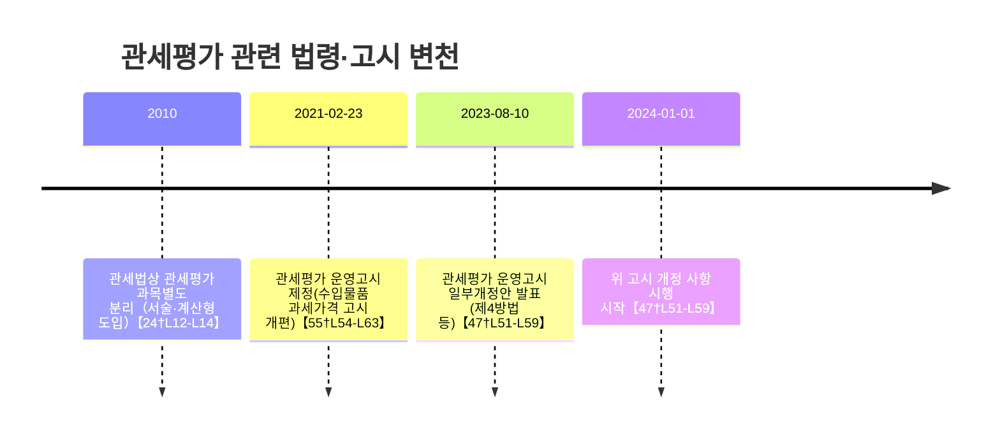

# Executive Summary  
관세평가 과목은 **관세 과세가격 결정**의 이론·절차를 다루며, 관세법·관세평가법·WTO 관세평가협정 등 핵심 법령과 고시·판례에 기반한다. 최근 기출분석에 따르면 **관세평가기본원칙**(예: 수출판매 실제지급가격, 특수관계 판정 등) 비중이 총점의 약 78.5%를 차지할 정도로 출제 빈도가 높다【25†L282-L290】. 시험은 80분 동안 A4 22행 16면 분량으로 서술(논술) 형식으로 치러지며, 30점 2문항과 20점 2문항(총 100점)으로 구성된다【23†L90-L94】. 최근 출제경향은 단순 법조문 서술을 넘어 **사례판단형** 문제가 증가하는 추세로, 특히 WTO 협정과 최신 개정 법령(관세평가 운영고시 2021·2024년 개정)과 연계된 문제가 출제된다【25†L309-L315】【47†L51-L59】. 본 리포트에서는 법령 조문·고시·기출분석 자료를 종합하여 과목구조, 주요 테마, 취약점, 문제유형, 출제트렌드, 함정포인트, 비전공자 학습전략, 최적 학습순서 등을 자세히 정리한다. 

## 1) 전체 구조 분석  
- **핵심 요약:** 관세평가 과목은 *관세평가법*과 *관세법* 제30조 이하(과세가격 결정원칙)·시행령, 그리고 WTO 관세평가협정이 법적 근간이며, **거래가격법(제1방법), 비교가격법(제2~6방법), 평가절차** 등으로 구성된다.  
- **상세 분석:** 과목의 골간은 **관세평가총설(과세가격의 정의·대상)**과 **과세가격 결정방법(총 6가지 방식)**이다. 관세법 제30조 제1항에 “수입물품의 과세가격은 수출국에서 수출판매로서 결정된 금액으로 한다”고 규정하며, 동법 시행령은 수출판매의 구체적 의미를 정한다. 이와 연계해 WTO 관세평가협정(1980년 채택) 제1조와 하위 해설문서가 적용된다【53†L38-L47】. 비교가격법(제2~3방법)은 동종·동류 물품의 거래가액을 기준으로, 제4~6방법은 국내판매가격 거꾸로 계산하여 과세가격을 결정하는 방식이다. 관세평가법은 2021년 제정된 단행본(박영기 저) 등을 통해 소개되었으며, WCO 기술문서와 판례·유권해석을 포괄적으로 해설하여 체계화됐다【53†L38-L47】【50†L73-L80】.  
- **시험 구조:** 2023년부터 관세사 2차는 과목별 A4 16면, 80분 동안 **30점×2문항 + 20점×2문항**(총 100점)로 출제된다【23†L90-L94】. 관세평가 역시 이 형식을 따르며, 일반적으로 30점 문항은 복합 사례분석(계산 포함), 20점 문항은 규정·절차 서술 위주다.  
- **실전 팁:** 과목이 방대하므로 출제 범위(법조문·고시·협정·판례) 전체를 체계적으로 파악해야 한다. 특히 *관세평가기본원칙(제1방법)*을 이해한 후, 각 비교가격법과 절차로 학습을 확장하라. 답안 작성 시엔 **“사례 안에서 규정·이론을 접목하고 과세가격을 도출”**한다는 관세평가 특유의 접근이 필요하다【25†L261-L270】. 시험장에서 계산문제가 나오면 차분히 각 단계(거래가격, 할인·가산요소 반영, 최종 과세가격 산출)를 정확히 풀어야 한다.  
- **예시 문제:** *“수입물품 A의 수출 판매가액과 관련 경비, 특수관계자 거래 내역이 주어질 때 과세가격을 구하고, 그 구성요소를 설명하시오.”* (2019~2024년 기출 응용형 예제)  
- **모범 답안 포인트:** 거래가액에 수입자 부담 수수료·중개료 등을 가산하고, 운임·보험료를 더한 후, 용기·포장비용 등을 제외하여 과세가격을 계산한다. 특수관계 거래가 있을 경우 거래가격 인정 요건(정상가격) 여부를 검토하며, WTO 협정과 판례·고시 기준을 언급한다.  
- **출처:** 관세법 제30조 이하(과세가격 결정원칙)【37†L5-L10】, 관세평가 운영고시【55†L54-L63】, 기출문제 분석【25†L282-L290】, 삼일인포마인 *관세평가법* 서문【53†L38-L47】 등.  

|주요 주제|관련 법령·자료|출제 경향 (2015-24)|
|:---:|:---|:---|
|관세평가 총설(과세가격 개념 등)|관세법 제30조·시행령, WTO협정|기출 빈번 (기본원칙 약78%)【25†L282-L290】|
|수출판매와 거래가격법(제1방법)|관세법 제30조·시행령 제17조|높은 중요도 (수출판매 판단)|
|비교가격법(2·3방법)|관세법 제31~32조, 고시·판례|중간 (최근 증가 추세)|
|비교가격법(4·5·6방법)|관세법 제33~35조, 관세평가 운영고시|증가 (4,6방법 자주 출제)【25†L298-L304】|
|평가절차(신고·사후검증)|관세법·관세평가법, 고시규정|낮은 편 (약1.5%)【25†L298-L304】|

## 2) 자주 출제되는 영역 (핵심 테마·법령·조문별 빈도)  
- **핵심 요약:** 관세평가에서는 *관세평가기본원칙*(특히 수출판매 실제가격 결정)과 1~6방법 각각의 계산문제가 자주 출제되며, 특히 **기본원칙(제1방법)**의 출제 비중이 전체의 약 78.5%【25†L282-L290】에 달한다.  
- **상세 분석:** 2015~2024년 기출분석에 따르면 **관세평가기본원칙**(제1방법 관련 문제)이 785점(78.5%)으로 압도적이다【25†L282-L290】. 예를 들어 *“수출가격 인정요건(수출판매)”, “수수료·중개료 산입 기준”, “용기·포장비용 제외 여부”* 등이 자주 묻는다. 비교가격법은 각 방법별로 출제 비중이 분산되어 있는데, 2·3방법(약3%), 4방법(약6.5%), 5방법(약1.5%), 6방법(약9%)으로 나타났다【25†L298-L304】. 최근 들어 제4·6방법 문제 비중이 늘어나는 추세이다.  
- **실전 팁:** 출제빈도가 높은 기본원칙(수출판매·정상가격 판단 등)과 비교가격법(특히 제4·6방법)을 우선학습하고, 관련 **법조문(관세법§30~35조, 시행령)과 관세청 고시**를 함께 숙지하라. 예를 들어 용기비용은 *“수입용기로서 재사용되는 경우만 과세가격에서 제외”*(관세법시행령 제17조)임을 확인하고, 사례문제에서 놓치지 않아야 한다. 기출 테마(예: “사후귀속이익 계산”, “권리사용료의 거래조건성”)를 파악해 취약점을 보완하라.  
- **예시 문제:** *“특수관계인 거래가 포함된 수출계약의 자료가 주어질 때, 해당 거래가격이 과세가격으로 인정되는 요건을 설명하시오.”* (연도별 기출유형 예)  
- **모범 답안 포인트:** 관세법·시행령상 수출판매 요건(승낙시점·양도적 조건 포함 여부), 특수관계 규정(관세법 §30조3항4호) 등을 언급한다. 수수료·중개료(구매수수료 제외), 운임·보험료 계산 방법, WCO 예해·판례(특수관계 할인 판정 등)를 구체적으로 서술해야 한다.  
- **출처:** 기출분석표【25†L282-L290】【25†L298-L304】, 관세법 §30조·시행령 §17조【37†L5-L10】, 관세평가 고시·판례자료.  

## 3) 실무 미경험자 취약점  
- **핵심 요약:** 실무 경험이 없는 수험생은 거래구조 파악과 계산 단계를 혼동하기 쉬우며, 특히 **거래 형태 구분(예: 위탁수출·원산지 지정거래)**과 **할인·가산 요소 처리**에서 실수가 잦다.  
- **상세 분석:** 학습자 커뮤니티 의견에 따르면, 이론적으로는 수월해도 실제 사례에서 *“수출판매인지 여부 판단”*이나 *“관련자료(인보이스, 계약서) 해석”*이 어려워 실수를 한다. 예를 들어, FOB·CIF 등 인코텀즈 차이를 체감하기 어렵거나, 특수관계자 할인 사례에서 **정상가격 요건**(관세법 제30조3항4호)의 예외 판단이 헷갈린다. 또한 계산 과정에서 할인률·원가조정 등 여러 단계 산정이 복잡해 실수가 많다. 이패스관세사 분석에 따르면 “관세평가는 다른 과목과 달리 수학적·논리적 귀납 접근이 필요”하므로, 개념 이해 없이 암기식으로 준비하면 과락 위험이 높다【25†L261-L270】.  
- **실전 팁:** 실무감각 부족을 보완하기 위해 *①기본이론 익힌 후 ②다양한 사례풀이 연습*하는 3단계 학습법을 적용하라【25†L272-L280】. 특히 거래형태별 사례(직접수출·타인위탁수출 등)와 계산 연습을 충분히 반복해야 한다. 과거 출제된 수출판매·사후귀속이익 사례를 모의답안으로 작성해보며, 오류 시행착오를 줄이자. 또한 *관세청 유권해석·판례*를 통해 어려운 쟁점(예: 회사지불지원, 판매후권리사용료)이 어떻게 처리되는지 파악하라.  
- **예시 문제:** *“수입신고 시점의 해외 및 국내 운임·보험료가 서로 다른 두 계약 A, B의 과세가격을 구하고 차이 이유를 설명하시오.”* (계산 및 설명 복합문제 예시)  
- **모범 답안 포인트:** 각 수입 거래에서 수출국→도착지 운임·보험을 정확히 구분해 더하고, 비용 항목을 조정한다. 거래가 달라 과세가격 차이가 발생하였음을 논리적으로 설명해야 한다. 예: A는 CIF조건으로 운임 포함된 가격, B는 FOB로 운임 별도이므로 과세가격 계산이 달라진다 등을 기재한다.  
- **출처:** 이패스관세사 학습전략【25†L261-L270】, 수험자 경험담, 관세청 유권해석 사례집(관세평가 전자도서관) 등.  

## 4) 문제 유형 및 난이도 (서술형 기준·배점 예시)  
- **핵심 요약:** 관세평가 문제는 *사례분석형(계산포함)*과 *법·절차 서술형*이 혼합되어 출제된다. 30점 문항은 복합 사례 및 계산이 많으며, 20점 문항은 핵심 규정·절차 기술을 요구한다. 난도는 최근 높아져 상위권도 60점 이상 득점을 목표로 한다.  
- **상세 분석:** 출제유형을 보면, **30점 문항**은 구체적 거래자료를 기반으로 과세가격 산정 또는 분쟁 쟁점 분석 문제(예: “A사의 거래조건을 검토하고 과세가격 결정방식을 논하라”)가 많다. 반면 **20점 문항**은 비교가격법 각 방법의 적용 요건이나 사례(예: “제4방법의 선정 요건 및 절차를 설명하시오”) 위주다. 난이도는 최근 2~3년간 상승했는데, 2024년에는 과거 단순 암기형에서 벗어나 **판단형 비중이 늘어났다**【25†L309-L315】. 서술식 채점기준은 구체적 제시 없이 공개되지 않으나, 일반적으로 **핵심 키워드의 충실한 기술**과 계산의 정확성이 중요하다. 예를 들어 수수료·운임 비중을 잘못 반영하거나 수출판매 판정 기준을 오기하면 큰 감점 요인이 된다.  
- **실전 팁:** 문제를 받으면 먼저 **핵심 쟁점(key issue)**을 선별해 답안 목차를 잡자. 30점 문제의 경우 계산 오류 방지를 위해 단계별 산식과 단위(통화) 확인을 철저히 하고, 예상 풀이시간(예: 각 문항당 20분 선) 내에 답안을 구성해야 한다. 20점 문제는 정답 키워드(예: *“독립거래원칙”*, *“통상의 이윤”* 등)를 포함해 간결하게 서술하되, 필요시 예시(판례, 협정 조문)로 뒷받침하면 감점 최소화에 도움이 된다. 모범답안 작성 연습을 통해 ‘모른다’ 대신 **예상 가능한 규정과 논리를 연결**해 기술하는 연습이 필수다.  
- **예시 문제:** *“제4방법(국내판매가격법)을 적용할 수 있는 요건과 계산절차를 설명하라.”* (모의고사 및 예제 유형)  
- **모범 답안 포인트:** 제4방법은 “수출판매적용 불가·동종수출가격 찾기 어려운 경우, 수입물품의 국내판매가격에서 통상이윤 및 제세 공제”임을 법조문(관세법 제33조)과 해설고시 기준으로 기술한다. 예를 들어 “동일수출물품 거래가격이 없는 B사의 경우, B사의 국내판매가격(국내판매가액)에서 협정상의 통상이윤과 관련 운임·관세를 공제하여 과세가격을 결정”하는 절차를 서술한다.  
- **출처:** 이패스관세사 문제분석【25†L309-L315】, 관세청 고시 및 판례, 학원 모의문제 해설.  

## 5) 최근 출제 트렌드 (개정법령·키워드 변화)  
- **핵심 요약:** 최근 3~5년간 관세평가 출제경향은 **새로운 고시 개정사항 반영**과 **협정·세계동향 연계** 문제가 눈에 띈다. 2021년과 2023년 관세청 고시 개정(‘관세평가 운영고시’)이 주요 키워드가 되었다.  
- **상세 분석:** 2021년 2월 개정된 ‘수입물품 과세가격 결정 고시’(이후 명칭 변경)에서 *수출판매* 개념 명확화와 *거래가격 배제사유* 정비가 이루어졌다【55†L54-L63】【55†L69-L80】. 예를 들어 개정 고시가 **“수출판매로 인정되지 않는 경우 거래가격을 과세가격으로 인정할 수 없다”**고 명시(제14조)하고, 특수관계 할인 사례를 정상가격으로 인정하는 기준을 상세 규정했다【55†L54-L63】【55†L69-L80】. 2023년에는 제4방법 적용절차를 개편하는 고시 일부개정(4방법 적용 제한사유 구체화 등)이 발표되었고(2024.1.1 시행)【47†L51-L59】, 이는 내년도 출제 이슈가 될 수 있다. 한편 **WTO 관세평가협정**의 해석이 계속 강조되며, 국제적 용어(예: “free on board vs cost, insurance, freight” 등)와 WCO 기술문서 용어 숙지가 유리하다. 법령 개정 이외에도 대외 무역환경 변화(코로나 이후 물류비 상승, 디지털 무역 거래 증가 등)도 시험문제의 배경이 되고 있다.  
- **실전 팁:** 최신 경향을 반영하기 위해 **최근 기출 및 답안 해설**을 반드시 분석하라. 개정 고시 조항(예: 고시 제14조, 제27~28조 등)을 숙지하고, 예제 문제로 출제 여부를 점검한다. 또한 WTO/WCO 문헌과 사후귀속이익 같은 국제적 이슈(‘이의세금에 대한 환급’ 등) 키워드를 체크해두면, 관련 논점 출제 시 빠르게 대응 가능하다.  
- **예시 문제:** *“2021년 개정된 관세평가 고시에서 수출판매의 개념이 어떻게 규정되었는지 설명하시오.”* (2021년 고시 반영형)  
- **모범 답안 포인트:** 2021년 개정 고시 제14조를 인용하여 “우리나라에 도착한 수출물품에 해당하지 않는 경우, 그 거래가격은 과세가격으로 인정하지 않는다”고 명시했음을 기술. 이와 연계해 *“따라서 국내 전환 직후 물품 판매나 운송거래는 수출판매로 보지 않는다”*는 판례·지침 내용을 포함하여 설명한다.  
- **출처:** 관세청 고시(2021·2023 개정)【55†L54-L63】【47†L51-L59】, 기출총평【25†L309-L315】, WTO 협정 해설.  

## 6) 함정 및 실수 포인트 (오답 사례·감점 기준)  
- **핵심 요약:** 시험장에서 흔한 함정은 *“문제 상황과 맞지 않는 법 규정 적용”*과 *“계산 착오”*다. 특히 출제자가 유도하는 단서(예: 특수관계 할인, 우대세율 적용 등)에 흔들리지 말고 핵심 원칙을 적용해야 한다.  
- **상세 분석:** 기출 예를 보면, “특수관계인지 아닌지”나 “어느 방법을 적용해야 하는지”를 잘못 판단해 오답이 된 사례가 많다. 예를 들어 **정상가격인정요건**(관세법 제30조3항4호)에서 *“기간∙지역 등 중요한 할인조건이 없는지”*를 간과한 답안은 감점이 크다. 또한 **계산식 누락·오기** 사례가 많다. 수출가격에 모든 가산요소를 더하지 않거나, 중복 제외 여부를 잘못 처리하면 답안이 크게 떨어진다. 문제지에 *“조건부 용기 제외” 등 판정을 시험하려는 함정*이 있으니, 출제자의 의도를 파악해야 한다. 합격생들은 **감점 기준**으로, “핵심 규정을 틀리면 대폭 감점, 계산·단순 서술 오류는 부분 감점”을 꼽는다.  
- **실전 팁:** 답안 작성 전 문제를 꼼꼼히 읽고 **핵심 포인트(Key Point)**를 체크리스트로 정리하라. 문제에서 제공된 수치는 반드시 모두 활용하고, 계산 중간값을 명시하여 산출 과정을 검토하기 쉽도록 한다. 복잡한 사례문제에서는 첫 문단에 결론(계산결과나 정성적 판단)을 간단히 요약하고 이후 근거를 상세히 기술하면 감점 위험이 줄어든다. 서술형에서는 명확한 법조문·고시 조항(예: 관세법§30, 고시§27조 등)을 언급해 정답 키워드를 포함시키자.  
- **예시 문제:** *“가산요소 중 권리사용료를 계산할 때 주의할 점은 무엇인가?”* (과거 수험생 오답 사례)  
- **모범 답안 포인트:** “권리사용료는 **해당 물품과 관련성**과 **거래조건성**이 충족될 때만 과세가격에 포함된다”는 점을 명시한다. 이를 위해 예를 들어 “특수관계 거래여도 구매선택권 부재나 동일공식 적용 시에는 거래조건성이 인정된다”(고시 예시)고 서술해야 한다. 단순히 관세법 제30조 조항 이름만 쓰지 않고, 실제 계산 예시(판매가격·요율 곱산 등)를 포함하면 이해도를 높일 수 있다.  
- **출처:** 최근 기출 해설, 관세청 예규 및 유권해석, 이패스관세사 함정 분석자료.  

## 7) 비전공자 맞춤 학습법 (주간 계획·교재·강의 추천)  
- **핵심 요약:** 비전공자는 *관세평가 용어와 전제지식*부터 탄탄히 익혀야 하며, 초반에는 **법조문→기본개념→기출풀이** 순으로 학습한다. 강의·교재는 입문서(용어 정리) → 심화서(사례 중심) 순으로 이용한다.  
- **상세 분석:** 비전공자는 수출·수입 실무 용어나 계약조건 이해가 어렵기 때문에, **첫 1~2개월은 개념 정리**(예: *수출판매, 운임구성, 간접·직접 지급 구분 등*)에 집중하자. 박영기 *관세평가법*이나 *관세평가실무해설*(한국관세무역개발원 발간) 같은 교재로 이론체계를 익힌 뒤, 관세청 고시와 기출문제로 응용 능력을 키운다. 입문 단계에선 관세총론·무역학 기본 강의를 참고해도 좋다. **학습 계획(6/3/1개월 예시)**:  
  - *6개월 전:* 매주 법조문·고시·협정 읽기(주 2회) + 핵심예제풀이(주 1회).  
  - *3개월 전:* 기출문제 집중 분석(주 2회) + 모의고사(매월) + 오답노트 작성.  
  - *1개월 전:* 반복 학습 및 핵심 키워드 암기(예: 표로 정리), 약점 보완(취약 유형 문제풀이), 2주 모의고사 풀기.  
- **강의/교재 추천:** 입문강의로는 *FTA관세무역연구원*의 기본 강의(심인혜·전용대 관세사 등)와 *이패스관세사* 황성택·박창환 강의가 유용하다. 교재는 **박영기 ‘관세평가법’(2021)**【53†L38-L47】, 한국관세무역개발원 *관세평가실무해설*, *관세평가운영 고시 해설서* 등을 권장한다. 특히 박영기 저서는 WTO협정·판례까지 포함되어 비전공자도 사례연습을 통해 이론을 체득할 수 있다【53†L38-L47】.  
- **예시 일정표(주간 계획):**

  |기간|학습 내용 예시|
  |---|---|
  |1~2개월 차|법조문 개요(관세법·평가법) 이해, 기본개념(수출판매·특수관계 등) 습득, 용어집 작성|
  |3~4개월 차|각 평가방법별 핵심 이론 정리(비교가격법 1~6방법), *기출문제* 학습 시작(기본문제 위주)|
  |5개월 차|중급 사례풀이 강화(복합문제, 계산문제 집중), 오답노트 축적, 틀린 부분 심화학습|
  |6개월 차|종합 모의고사(시간 맞춰 4문항 풀기), 취약점 집중 복습, 핵심표·노트 마무리|

- **출처:** 박영기 *관세평가법* 서문【53†L38-L47】, 학원 수강후기, 비전공자 합격수기.  

## 8) 최적의 공부 순서 (단원별 우선순위·시간배분)  
- **핵심 요약:** 학습 초반에는 **기본원칙(관세법 §30조) 및 관련 고시**부터 정복한 뒤, 비교가격법 1·4·6방법 순으로 공부하며, 마지막에 기타(3·5방법·평가절차)를 다진다.  
- **상세 분석:** 가장 중요한 **관세평가기본원칙(수출판매·관련 가산/공제 항목)**을 먼저 마스터해야 후속 단원 이해가 수월하다. 이어서 빈도가 높은 비교가격법(2·3·4·5·6방법)을 학습하는데, 경험적으로 **제1방법(수출판매법)**을 끝낸 뒤 **제4방법(국내판매법)**과 **제6방법(최후방법)** 순서가 효율적이다(이 두 방법은 실무적 분쟁 이슈가 많고 난이도가 높음). 나머지 2·3·5방법과 평가절차(신고·사후검증)는 상대적으로 비중이 낮으나, 여유 시 정리해야 한다. 이패스강사의 분석에 따르면 **이론 학습 후 단계적 케이스 연습→모의실전**이 효과적이다【25†L272-L280】.  
- **우선순위 표 및 시간배분 예시 (6개월 기준):**

  |단원(주제)|핵심내용|공부 비중(%)|우선순위|
  |:---:|:---:|:---:|:---:|
  |① 관세평가기본원칙|수출판매·거래가격 인정 요건, 수수료/운임·보험·용기비용 기준|30%|1순위|
  |② 비교가격법 제1·4·6방법|동종가격법(2·3), 국내판매법(4), 최후방법(6) 설명·계산|30%|2~3순위|
  |③ 비교가격법 제2·3·5방법|동질·유사가격법(2·3), 특수경우법(5) 요건 설명|15%|4순위|
  |④ 기타 가산/공제 요소|권리사용료·로열티 등 가산요소 처리, 사후귀속이익|15%|5순위|
  |⑤ 평가절차·신고|신고절차, 사후검증 절차, 과세요건(고시) 등|10%|6순위|

- **시간배분 예시:** 총 학습시간의 약 30%를 기본원칙과 1방법 학습에 투자하고, 40%는 4·6방법 및 계산 연습에, 나머지 30%를 기타 방법과 법·고시 분석에 배분한다.  
- **출처:** 이패스관세사 학습전략【25†L272-L280】, 관세청 고시·판례, 수험 전략서.  

**참고출처:** 관세법·시행령·관세평가법 원문, 관세청 고시(관세평가운영고시 등)【55†L54-L63】【47†L51-L59】, 기출문제 해설【25†L282-L290】【25†L309-L315】, *관세평가법*(박영기, 삼일인포마인, 2021)【53†L38-L47】, 관세청·학원 강의자료 등.