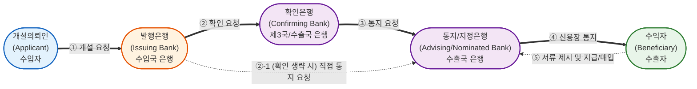
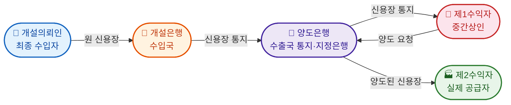
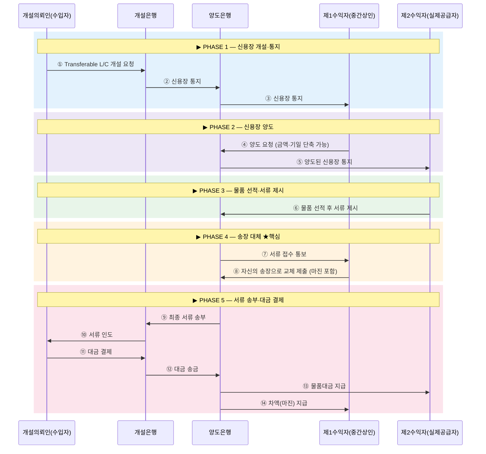

# PART 3-2 — 신용장(UCP 600 / eUCP / ISBP)
**등급: 🟠A | 출제빈도: 10/13년 | 평균배점: 약 25점 | 최고배점: 50점(2020)**

> 📌 **2026 출제 예측**: [[#UCP 600 Article 14|UCP 600 제14조]](서류심사기준) + [[#UCP 600 Article 16|UCP 600 제16조]](불일치서류 처리절차) 세트 출제 또는 [[#UCP 600 Article 38|UCP 600 제38조]](양도가능신용장) 재출제 고위험. 2025년 조문 직접 서술형 트렌드 지속 예상.

---

## 📝 핵심 요약

##### **1. UCP 600 기본 법리**
- **독립성 원칙** ([[#UCP 600 Article 4|UCP 600 제4조]]): 
	- 신용장은 매매계약과 **별개**, 은행은 기초계약 관계없음
- **서류거래(추상성) 원칙** ([[#UCP 600 Article 5|UCP 600 제5조]]): 
	- 은행은 **서류**만 취급, 물품 실제 상태 무관
- **일치하는 제시** ([[#UCP 600 Article 2|UCP 600 제2조]]): 
	- 신용장 조건 + UCP 600 + ISBP 3중 기준
	- 문면(on their face)상 심사
	- **서류 간 모순(Conflict) 없으면** 일치 ([[#UCP 600 Article 14|UCP 600 제14조]](d)), 동일 불필요
##### **2. 지급이행(Honour) vs 매입(Negotiation) ★2017·2015**
- **Honour 3유형** ([[#UCP 600 Article 2|UCP 600 제2조]]): 
	- 일람지급→즉시
	- 연지급→만기+약속(환어음 없음)
	- 인수→환어음 인수+만기
- **매입(Negotiation)**: 
	- 지정(확인)은행 가능, 개설은행은 매입 불가
- **의무 주체**: 
	- 발행은행([[#UCP 600 Article 7|UCP 600 제7조]]) → 결제 취소불능 의무
	- 확인은행([[#UCP 600 Article 8|UCP 600 제8조]]) → 결제 또는 **상환청구 없이 매입** 의무

##### **3. 서류심사기준 + 불일치서류 처리 ★2024·2021**
- **심사기간** ([[#UCP 600 Article 14|UCP 600 제14조]](b)): 제시 다음 날부터 최대 **5 영업일** (선적일·유효기일 무관)
- **운송서류 제시** ([[#UCP 600 Article 14|UCP 600 제14조]](c)): 선적일 후 **21일** 이내 & 신용장 유효기일 이전
- **비서류적 조건** ([[#UCP 600 Article 14|UCP 600 제14조]](h)): 신용장이 어떤 조건을 요구하면서 그 조건을 충족했음을 입증할 **서류를 명시하지 않은 경우** → 은행은 해당 조건을 **충족된 것으로 간주하고 무시** (서류심사 대상 아님)
- **거절통지** ([[#UCP 600 Article 16|UCP 600 제16조]](c)) 필수 3가지:
	- ①**거절의사** 
	- ②**불일치사항 각각** 
	- ③**서류처분** (a보관-제시인지시 / b보관-권리포기교섭 / c반송 / d기수령지시이행)
- **실권** ([[#UCP 600 Article 16|UCP 600 제16조]](f)): 5영업일 내 거절통지 불이행 → 개설·확인은행 불일치 주장 **상실**

##### **4. 원본서류 · 상업송장 수리요건 ★2025**
- **원본 수리** ([[#UCP 600 Article 17|UCP 600 제17조]](c))
	- 은행은 서류 발행인의 <u>외관상 원본 서명·표시·스탬프 또는 레이블이 있는 서류를, 그 서류 자체에 원본이 아니라는 표시가 없는 한, **원본으로 취급**</u>
	- 또는 다음 3가지 중 하나이면 원본으로 수리: ①수기·타자·천공·스탬프 ②레터헤드 작성 ③"Original" **명시**
- **상업송장 발행요건** ([[#UCP 600 Article 18|UCP 600 제18조]](a)): 
	- **①수익자 발행 ②개설의뢰인 수신 ③신용장과 동일통화 ④발행인 서명불요**
	- 신용장 금액 초과 송장 → 수리 가능, 단 초과분 결제 불가
	- 송장 물품명세 → 신용장과 **일치(correspond)** 필수

##### **5. 운송서류 7종 ★2020·2025**

| 항목        | Art.19  복합 운송 서류 | Art.20  선하증권                             | Art.21  비유통 해상화물 운송장   | Art.22  용선계약 선하증권                  | Art.23  항공 운송 서류              | Art.24  도로· 철도· 내륙수로 운송서류         | Art.25  특송 수령증· 우편 수령증  |
| --------- | ------------------------- | ------------------------------------------- | ------------------------------- | ---------------------------------------- | -------------------------------------- | --------------------------------------------- | ----------------------------------- |
| **서명권자**  | 운송인·선장·대리인                | 운송인·선장·대리인                                  | 운송인·선장·대리인                      | 선장·**선주·용선자**·대리인 (선주·용선자 대리 시 본인 명칭 필수) | 운송인·대리인 (**선장 ❌**)                     | 운송인·대리인 (철도: 운송인 불명 시 **철도회사 스탬프** 가능)        | 특송: **특송업체 직접** (대리인 ❌) / 우편: 우편서비스 |
| **선적 표시** | 발송·수탁·본선적재 중 택1           | **본선적재(shipped on board)**                  | **본선적재(shipped on board)**      | **본선적재(shipped on board)**               | **수취(accepted for carriage)**          | 날짜 명기된 수령 스탬프·수탁일·선적일                         | 특송: 픽업일·수탁일 / 우편: 스탬프+날짜            |
| **선적일**   | 발행일 (별도 스탬프·표기 시 그 날짜)    | 발행일 (본선적재표기 명시 시 그 날짜)                      | 발행일 (본선적재표기 명시 시 그 날짜)          | 발행일 (본선적재표기 명시 시 그 날짜)                   | 발행일 (실제 선적일 특기 시 그 날짜) ⚠️ **편명·날짜 무시** | 수령 스탬프·표기가 있으면 그 날짜 / 없으면 발행일                 | 특송: 픽업·수탁일 / 우편: 스탬프·서명 일자          |
| **원본**    | 단독 원본 또는 Full Set 전부      | 단독 원본 또는 Full Set 전부                        | 단독 원본 또는 Full Set 전부            | 단독 원본 또는 Full Set 전부                     | **탁송인용 1통** (Full Set 요구해도)            | 도로: 탁송인용 원본 / 철도: **부본도 원본** / 내륙수로: 표시 무관 원본 | Full Set 개념 없음                      |
| **환적**    | 단일 서류 커버 시 **무조건 수리**     | ①단일B/L커버 허용 ②금지 시 **컨테이너·트레일러·래쉬선** 증명 시 수리 | ②금지 시 **컨테이너·트레일러·래쉬선** 증명 시 수리 | 명시적 규정 없음                                | 단일 서류 커버 시 **무조건 수리**                  | 단일 서류 커버 시 **무조건 수리**                         | 명시적 규정 없음                           |
| **용선계약**  | 종속 표시 **불가**              | 종속 표시 **불가**                                | 종속 표시 **불가**                    | 은행은 용선계약서 **심사 안함**                      | —                                      | —                                             | —                                   |

##### **6. 보험서류 · 유효기간 · 과부족용인 ★2025·2019**
- **보험 최저 부보** ([[#UCP 600 Article 28|UCP 600 제28조]](f)(ii)): 
	- CIF/CIP 가액 × **110%** 이상 
	- 보험서류 발행일 ≤ 선적일
- **유효기간 연장** ([[#UCP 600 Article 29|UCP 600 제29조]]): 
	- 휴업일 겹치면 다음 첫 영업일 연장
	- 선적 후 제시기간은 불연장
- **과부족용인** ([[#UCP 600 Article 30|UCP 600 제30조]]):
	- (a) "about/approximately" → **단가/금액/수량 ±10%**
	- (b) M/L 없음 + 산적화물(포장·개수 단위 아님) + 금액 미초과 → **수량 ±5%**
	- (c) M/L 없음 + 전량 선적 + 단가 유지 → **금액 -5%** ((a)(b) 적용 시 제외)
- **분할선적** ([[#UCP 600 Article 31|UCP 600 제31조]](c)): 
	- 특송·우편외 복수서류 → 동일운송수단+동일항차+동일목적지 → 분할선적 **아님**
	- 특송·우편 복수서류 → 동일업체+동일날+동일목적지 → 분할선적 **아님**

##### **7. 은행 면책 + 양도가능신용장 ★2024·2022**
- **면책 3조** ([[#UCP 600 Article 34|UCP 600 제34조]]~36조): 
	- 34=서류효력
	- **35=전달면책** + 지급 후 서류 분실 시에도 **결제의무 유지**(단서)
	- 36=불가항력
	- 불가항력 사유 ([[#UCP 600 Article 36|UCP 600 제36조]]): 
		- 천·폭·내·반·전·테·파·기
		- 업무 재개 후 만료 신용장 → 지급 불이행
- **양도가능신용장** ([[#UCP 600 Article 38|UCP 600 제38조]]): "Transferable" **명시** 필수
	- 변경 가능 6항목: 금액↓ / 단가↓ / 유효기일↓ / 최종제시일↓ / 선적기간↓ / 부보비율↑
	- **1회 양도** 원칙 (재양도 불가) / 분할선적 허용 시 분할양도 가능
	- **송장대체**: 제1수익자가 자신의 마진 포함 송장으로 교체 — 미이행 시 양도은행이 제2수익자 서류 직접 제시

---

## 🗺️ UCP 600 전체 조문 지도 (출제 빈도 기준)

| 조문                                                                                                                      | 주제                      | 출제 이력              | 우선순위 |
| ----------------------------------------------------------------------------------------------------------------------- | ----------------------- | ------------------ | ---- |
| [[#UCP 600 Article 2\|UCP 600 제2조]]                                                                                     | 정의(지급이행·일치하는 제시·지정은행 등) | 2017·2015 ★반복      | 🔴최상 |
| [[#UCP 600 Article 14\|UCP 600 제14조]]                                                                                   | 서류심사기준                  | 2024               | 🔴최상 |
| [[#UCP 600 Article 15\|UCP 600 제15조]]                                                                                   | 일치하는 제시                 | 2024               | 🔴최상 |
| [[#UCP 600 Article 16\|UCP 600 제16조]]                                                                                   | 불일치서류 처리                | 2021               | 🔴최상 |
| [[#UCP 600 Article 17\|UCP 600 제17조]]                                                                                   | 원본서류 및 사본               | 2025               | 🟠상  |
| [[#UCP 600 Article 18\|UCP 600 제18조]]                                                                                   | 상업송장                    | 2025               | 🟠상  |
| [[#UCP 600 Article 19\|UCP 600 제19조]]~25조                                                                               | 운송서류 7종                 | 2020·2025·2023 ★반복 | 🔴최상 |
| [[#UCP 600 Article 28\|UCP 600 제28조]]                                                                                   | 보험서류                    | 2019               | 🟠상  |
| [[#UCP 600 Article 29\|UCP 600 제29조]]                                                                                   | 유효기간 연장                 | 2025               | 🟠상  |
| [[#UCP 600 Article 30\|UCP 600 제30조]]                                                                                   | 과부족용인(M/L Clause)       | 2025·2017·2015 ★3회 | 🔴최상 |
| [[#UCP 600 Article 31\|UCP 600 제31조]]                                                                                   | 분할선적                    | 2023               | 🟡중  |
| [[#UCP 600 Article 34\|UCP 600 제34조]] [[#UCP 600 Article 35\|UCP 600 제35조]] [[#UCP 600 Article 36\|UCP 600 제36조]] | 은행의 면책                  | 2024               | 🟠상  |
| [[#UCP 600 Article 38\|UCP 600 제38조]]                                                                                   | 양도가능신용장                 | 2022               | 🟠상  |

---

## ■ MODULE 0. UCP 600 기본 구조

### 1. UCP 600 개요

- 정식명칭: **U**niform **C**ustoms and **P**ractice for Documentary Credits, 2007 Revision, ICC Publication No. **600**
- 시행일: 2007년 7월 1일
- 전 **39개 조문** 구성 (정의 [[#UCP 600 Article 2|UCP 600 제2조]], 해석 [[#UCP 600 Article 3|UCP 600 제3조]] 별도)
- 법적 성격: 국제상관습 규칙 (임의규정) — 당사자 간 합의로 배제 가능하나, 신용장에 "Subject to UCP 600" 기재 시 당사자 구속력 발생

### 2. UCP 600 핵심 당사자 정의 ([[#UCP 600 Article 2|UCP 600 제2조]])

| 용어                        | 정의                                            |
| ------------------------- | --------------------------------------------- |
| **발행은행(Issuing Bank)**    | 개설의뢰인(Applicant)의 요청 또는 자신을 위하여 신용장을 발행하는 은행  |
| **확인은행(Confirming Bank)** | 발행은행의 수권·요청에 따라 신용장에 확인(Confirmation)을 추가한 은행 |
| **지정은행(Nominated Bank)**  | 신용장이 이용가능하게 된 은행 (Any Bank = 모든 은행 포함)        |
| **통지은행(Advising Bank)**   | 발행은행의 요청으로 신용장을 통지하는 은행                       |
| **수익자(Beneficiary)**      | 신용장이 개설된 자 (= 수출자)                            |
| **개설의뢰인(Applicant)**      | 신용장의 개설을 요청한 당사자 (= 수입자)                      |

#### 🔄 당사자 간의 절차상 관계 및 구조

---

## ■ MODULE 1. 신용장의 기본 법리 ([[#UCP 600 Article 2|UCP 600 제2조]]·제4조·제5조)

### 1. 핵심 원칙 3가지 - 독립성, 서류거래(추상성), 일치하는 제시

**① ==독립성==의 원칙 (Principle of Independence) — [[#UCP 600 Article 4|UCP 600 제4조]]**
- <u>신용장은 그 기초가 되는 매매계약 또는 기타 계약과 별개로 독립</u>하여 존재함
- 은행은 그러한 계약을 전혀 알지 못하거나 관계가 없음
- 수익자는 계약 당사자 간의 청구권 또는 항변으로부터 어떠한 이익도 얻을 수 없음

**② ==서류거래==의 원칙 (Principle of Documentary Dealing, ==추상성==의 원칙) — [[#UCP 600 Article 5|UCP 600 제5조]]**
- <u>은행은 서류를 취급하고, 그 서류와 관련된 물품·용역·이행을 취급하지 않음</u>
- <u>서류의 기재 내용으로만 심사함 (물품의 실제 상태 무관)</u>

**③ ==일치하는 제시==의 원칙 — [[#UCP 600 Article 2|UCP 600 제2조]] 및 [[#UCP 600 Article 14|UCP 600 제14조]](d)**
- **일치하는 제시([[#UCP 600 Article 2|UCP 600 제2조]])**: 제시된 서류는 
	- <u>**신용장 조건**</u>, 
	- <u>**UCP 600 해당(applicable) 조문**</u>, 그리고 
	- <u>**국제표준은행관행(ISBP)**</u>에 부합해야 함.
- **엄밀일치의 완화([[#UCP 600 Article 14|UCP 600 제14조]](d))**: 
	- <u>서류 심사는 오직 **==서류의 문면(on their face)==**만으로 판단하되</u>, 
	- <u>**==서로 모순되거나 상충(conflict)되지 않으면== 일치하는 제시로 인정**됨 (실무적 유연성 부여). </u>
	- 기재 내용이 신용장이나 다른 서류의 데이터와 내용과 완벽히 '**동일(identical)**'할 필요는 없음. 

---

## ■ MODULE 2. 지급이행(Honour) ([[#UCP 600 Article 2|UCP 600 제2조]]) ★2017·2015 반복 출제

### 1. 지급이행(Honour)과 매입(Negotiation)의 비교 — [[#UCP 600 Article 2|UCP 600 제2조]]

| 비교 쟁점                | 결제 (Honour) - 일람지급 sight payment | 결제 (Honour) - 연지급 deferred payment          | 결제 (Honour) - 인수 acceptance                  | 매입 (Negotiation)                                                                        |
| :------------------- | :--------------------------------------------------------------- | :-------------------------------------------------------------------------- | :--------------------------------------------------------------------------- | :------------------------------------------------------------------------------------------------------------------- |
| **핵심 개념**            | 즉시 지급                                                            | 지급 약속 + 만기 지급                                                            | 어음 인수 + 만기 지급                                                             | 선 지급 + 할인 매입                                                                                                      |
| **정의**               | 일치하는 서류를 확인한 후 **대금을 ==즉시 지급==**하는 방식                            | 일치하는 서류를 확인한 후 대금을 미래 만기일에 지급하겠다는 **==약속==(연지급 확약)을 하고   만기일에 지급** | 일치하는 서류를 확인한 후 수익자가 발행한 **환어음에 서명(==인수==)하여 지급의무를 확정 짓고   만기일에 지급** | 일치하는 서류를 확인한 후 대금을 상환받을 날이나 그 이전에  수익자에게 대금을 **미리 내어주고(==선지급==)   서류나 환어음 매입(할인)**                       |
| **주요 행위 주체**         | **개설은행,  확인은행,  지정은행** (<u>지정은행은 합의가 없는 한 의무 없음</u>)       | **개설은행,  확인은행,  지정은행** (<u>지정은행은 합의가 없는 한 의무 없음</u>)                  | **개설은행,  확인은행,  지정은행** (<u>지정은행은 합의가 없는 한 의무 없음</u>)                   | **오직 지정(확인)은행**   (개설은행은 신용장의 최종 책임자이므로 스스로 매입할 수 없음)                             |
| **대금 지급 시점**         | 서류 심사 직후 **(즉시)**                                                | 정해진 **미래 특정일 (만기일)**                                                        | 정해진 **미래 특정일 (만기일)**                                                         | 은행이 대금을 돌려받을 날이나 **그 이전 (선지급)**                                                                                      |
| **환어음(Draft) 필요 여부** | 통상적으로 불필요                                                        | **환어음 발행 안 함** (서류와 은행의 약속만으로 거래가 성립됨)                                      | **환어음 필수 발행** (어음이라는 실물 증권이 반드시 필요함)                                         | 서류 단독 또는 **환어음과 서류를 함께 사용**                                                                                          |
| **환어음의 지급인(Drawee)** | 해당 없음                                                            | 해당 없음                                                                       | 환어음을 인수하고 결제할 **해당 은행 자신 (자행)**                                              | 매입을 수행하는 지정은행이 아닌 최종 **결제를 담당할 다른 은행 (타행)**                                                                          |
| **유통 증권 발생 여부**      | 해당 없음                                                            | 유통 증권 없음 (은행의 서면 약속에 불과함)                                                   | **유통 가능** (은행이 서명하여 신용을 보증한 환어음은 시장에서 할인·유통됨)                                | 해당 없음 (매입 행위 자체가 자금을 조기에 융통해 주는 할인 기법임)                                                                              |

**💡 쟁점 요약 및 강조 포인트**

1. **행위 주체의 명확한 구분:** 
	1. **결제(Honour)**는 
		- <u>개설은행과 확인은행의 본질적이고 절대적인 의무</u>이며,
		- 지정은행도 권한을 받아 수행 가능한 반면, 
	2. **매입(Negotiation)**은 
		- <u>오직 중간에서 대금을 미리 융통해 주는 **지정은행**</u>만이 주체가 됩니다. 
2. **연지급, 인수, 매입의 차이 (가장 중요한 기준: 환어음, 지급인):** 
   * 연지급 vs 인수
	   * **연지급**은 미래에 돈을 준다는 점은 인수와 같지만 **환어음을 아예 사용하지 않습니다**.
   * 인수 vs 매입
	   * **인수**에 쓰이는 환어음은 돈을 줄 **은행 자신**을 지급인으로 적습니다.
	   * <u>**매입**에 쓰이는 환어음은 매입하는 은행이 아니라, 최종적으로 돈을 결제해 줄 **다른 은행(개설은행)**을 지급인으로</u> 적어야만 합니다.
1. **자금의 조기 융통(선지급) 구조:** 
	1. 매입은 본질적으로 만기일이 오기 전 수익자에게 자금을 미리 지급해 주고 권리를 사들이는 행위입니다. 
	2. 반면 연지급과 인수는 원칙적으로 만기일에 대금을 지급하는 방식이지만, 수익자가 원할 경우 권한을 받은 은행이 만기일 이전에 그 확약이나 어음을 선지급(할인)하여 대금을 앞당겨 줄 수도 있습니다.

### 2. 지급이행 의무 주체

- **발행은행**: 일치하는 제시 시 **결제(지급이행)** 의무 부담 ([[#UCP 600 Article 7|UCP 600 제7조]])
	- 개설은행은 신용장을 개설하는 시점부터 **결제(지급이행)**할 취소불능의 절대적 의무를 부담
	- 신용장이라는 것 자체가 '일치하는 제시에 대해 결제하겠다는 개설은행의 명백하고 취소불능인 확약'
- **확인은행**: 일치하는 제시 시 **결제(지급이행)** 또는 ==**매입**== 의무 부담 ([[#UCP 600 Article 8|UCP 600 제8조]])
	- 확인은행은 <u>신용장에 자신의 확인(개설은행 대신 지급 보증)을 추가</u>하는 시점부터 
	- 결제하거나 (일람지급, 연지급, 인수) 
	- ==**상환청구권 없이 (개설은행 부도 시에도 수출자에게 선지급한 돈을 회수하지 않음) 매입**==할 (대금 선지급/할인)
	- 취소불능의 의무를 부담 
- **지정은행**: 지급이행·매입 의무 없음 (<u>수권만 받은 상태</u>) — 다만, 확인은행이면 의무 발생
	- 추가로, 지정은행이 비록 확인은행은 아니더라도 
	- **"<u>명시적으로 합의하고 이를 수익자에게 통보**하는 경우(expressly agreed to by that nominated bank and so communicated to the beneficiary)</u>"에는 
	- 지정은행에게도 결제 또는 매입의 의무가 부과

---
## ■ MODULE 4. 서류심사기준 ([[#UCP 600 Article 14|UCP 600 제14조]]) ★2024 출제

**① 요건**

- **[[#UCP 600 Article 14|UCP 600 제14조]](a) — 심사 기준**: 지정은행·확인은행·발행은행은 제시된 서류가 <u>**문면상(On its face) 일치</u>하는 제시**를 구성하는지 여부를 **오로지 서류만을 기초로** 심사하여야 함
- **[[#UCP 600 Article 14|UCP 600 제14조]](b) — 은행의 심사 기간**:
  - **제시 다음 날부터 기산**하여 최대 **5 영업일(Five Banking Days)** 이내에 심사 완료
  - 5 영업일은 단축되거나 영향을 받지 않음 (선적일·제시기간 만료일 등에 관계없이)
- **[[#UCP 600 Article 14|UCP 600 제14조]](c) — 수익(출)자의 서류 제시기간의 제한**:
  - 운송서류 원본을 포함하는 제시는 **선적일 이후 21일 이내**, 그리고 어떠한 경우에도 **신용장 유효기일보다 늦지 않게** 이루어져야 함

**② 주요 서류심사 세부기준 ([[#UCP 600 Article 14|UCP 600 제14조]] 나머지 항)**

| 항목                                       | 내용                                                                                   |
| ---------------------------------------- | ------------------------------------------------------------------------------------ |
| [[#UCP 600 Article 14\|UCP 600 제14조]](d) | 서류의 데이터는 그 서류 자체, 다른 규정 서류, 신용장과 ==**모순(Conflict)되지 않으면 족함**== — 동일할 필요 없음           |
| [[#UCP 600 Article 14\|UCP 600 제14조]](e) | 상업송장 이외의 서류에 기재된 물품 등의 명세는 신용장 상의 명세와 <u>상충되지 않는 **일반 용어**</u>로 기재될 수 있음             |
| [[#UCP 600 Article 14\|UCP 600 제14조]](f) | 신용장에서 발행인이나 자료 내용을 명시하지 않고 기타 서류를 요구하는 경우, 요구된 서류의 기능을 충족하는 것으로 보이고 14조(d)와 일치하면 수리함 |
| [[#UCP 600 Article 14\|UCP 600 제14조]](g) | 제시되었지만 <u>신용장에 요구되지 않은 서류는 **무시되고 제시인에게 반송될 수 있음**</u>                               |
| [[#UCP 600 Article 14\|UCP 600 제14조]](h) | 신용장이 일치성을 표시하기 위한 <u>서류를 명시하지 않고 어떤 조건만 포함하고 있다면(**비서류적 조건**) 은행은 이를 **무시함**</u>     |
| [[#UCP 600 Article 14\|UCP 600 제14조]](i) | 서류는 신용장의 일자보다 이전의 일자가 기재될 수 있으나, <u>**그 서류의 제시일보다 늦은 일자가 기재되어서는 안 됨**</u>            |
| [[#UCP 600 Article 14\|UCP 600 제14조]](j) | 수익자·개설의뢰인 주소는 신용장·다른 서류에 기재된 것과 동일할 필요 없음 (단, <u>**동일 국가 내**이어야 함</u>)               |
| [[#UCP 600 Article 14\|UCP 600 제14조]](k) | 모든 서류상에 표시된 **송화인**이나 **탁송인**은 신용장의 **수익자일 필요가 없음**                                  |
| [[#UCP 600 Article 14\|UCP 600 제14조]](l) | <u>운송서류가 요건을 충족하는 한, 운송인, 선주, 선장 또는 용선자 이외의 **모든 당사자**(예: 포워더)에 의하여 **발행**될 수 있음</u> |

**③ 법적 효과**
- **불일치** 발견 시 → [[#UCP 600 Article 16|UCP 600 제16조]] 절차(**거절 또는 권리포기 교섭**) 적용
- **==5영업일 경과 후 통지 없이 서류 보유==** 시 → [[#UCP 600 Article 16|UCP 600 제16조]](f)에 따라 서류가 불일치한다는 주장을 상실하여 **==일치하는 제시==로 간주됨**

---

## ■ MODULE 5. 불일치서류 처리 ([[#UCP 600 Article 16|UCP 600 제16조]]) ★2021 출제

**① 요건 — 불일치 서류의 처리 절차 ([[#UCP 600 Article 16|UCP 600 제16조]](b))**

발행은행·확인은행·지정은행이 불일치 서류를 수령한 경우:

1. **권리포기(Waiver) 교섭**: 
	- <u>개설은행(Issuing Bank)이 독자적인 판단 하에 개설의뢰인에게 (일치하는 서류만 받을)**권리포기 여부를 교섭**</u>할 수 있음 -> 즉, 불일치 서류도 수용할지 여부 협의
	- <u>**교섭기간**: 서류심사기간(5영업일)내에 이루어져야 함</u>
2. **거절통지(Notice of Refusal)**: 
	- 5영업일 이내에 제시자에게 통지 必

**② 거절통지에 포함되어야 할 내용 ([[#UCP 600 Article 16|UCP 600 제16조]](c)) ★2021 10점 출제**

거절통지 시 다음 **3가지 내용**이 반드시 포함되어야 합니다.

1. (==**거절의사**==) 은행이 결제 또는 매입을 **거절**하고 있다는 내용
2. (==**불일치 사항**==) 은행이 거절을 근거로 하는 **각각의 불일치 사항**
3. (==**서류 처리**==) **서류의 처분 상태 (다음 a, b, c, d 중 어느 하나만 기재):**
   - a) (**보관 - 제시인 지시 대기**) 은행이 <u>제시인으로부터 추가 지시</u>를 받을 때까지 서류를 **보관**하고 있다는 것
   - b) (<u>**보관 - 권리포기교섭 또는 제시인 지시 대기**</u>) 개설은행이 개설의뢰인으로부터 (하자없는 서류를 받을) 권리포기를 수령하고 서류를 수리하기로 합의할 때까지, 또는 권리포기를 승낙하기로 합의하기 전에 제시인으로부터 추가 지시를 수령할 때까지 개설은행이 서류를 **보관**하고 있다는 것
	   - (쉬운 설명) 
		   - 현재 서류에 하자가 있어서 대금 지급을 거절합니다. 
		   - 다만, 서류를 바로 반송하지 않고 일단 저희(개설은행)가 보관하고 있겠습니다. 
		   - 언제까지 보관하냐면: 
			   1) 수입자가 제시서류의 하자를 용인하겠다(권리포기)고 하고, 우리 은행도 그것을 받아들여 결제해주기로(수리/승낙) 최종 합의가 끝날 때까지 또는 
			   2) 수입자와 은행이 그렇게 합의를 마치기 전에, 수출자(제시인) 측에서 '그럼 그냥 서류 돌려주세요' 같은 다른 지시가 오면 그 지시를 받을 때까지입니다."
   - c) (**반송**) 은행이 서류를 반송하고 있다는 것
   - d) (**제시인 지시 이행**) 은행이 제시인으로부터 <u>이전에 수령한 지시(**하자 발생 시 처리 지침**)</u>에 따라 행동하고 있다는 것
	   - 지시: 서류송부장(Covering Letter)에 미리 적어둔 하자 발생 시의 처리 지침
		   - 추심(Collection) 방식으로의 전환 지시
		   - 즉각적인 서류 반송 지시
		   - 개설의뢰인(수입자)과의 교섭 및 대기 지시

**③ 법적 효과**
- **(f) 실권조항 [[#UCP 600 Article 16|UCP 600 제16조]]**: 
	- **기한 내 거절통지 불이행 시** 
	- → 개설은행 또는 확인은행은 해당 서류가 일치하지 않는 제시를 구성한다고 주장할 권리를 상실함 (지정은행은 해당 없음)
- **(e) 서류 반송 재량 [[#UCP 600 Article 16|UCP 600 제16조]]**: 
	- 위 3-a) 또는 3-b)에 따라 서류를 보관하고 있다는 통지를 행한 은행은, 
	- 그 이후 언제든지 서류를 제시인에게 **반송할 수 있음(may return)** (의무가 아님)

---

## ■ MODULE 6. 원본 및 사본 ([[#UCP 600 Article 17|UCP 600 제17조]]) ★2025 출제

**① 요건 — 원본서류 수리요건 ([[#UCP 600 Article 17|UCP 600 제17조]])**

- **[[#UCP 600 Article 17|UCP 600 제17조]](a)**: 신용장에 명시된 서류는 각 서류마다 **적어도 원본 한 통**이 제시되어야 함
- **[[#UCP 600 Article 17|UCP 600 제17조]](b)**: 은행은 서류 발행인의 <u>외관상 **원본 서명·표시·스탬프 또는 레이블**이 있는 서류를, 그 서류 자체에 원본이 아니라는 표시가 없는 한, **원본으로 취급**한다</u>.
- **[[#UCP 600 Article 17|UCP 600 제17조]](c)**: 원본임을 나타내는 다른 명시가 없는 경우, 다음 <u>**3가지 조건 중 하나**</u>를 충족하면 원본으로 수리함:
  1. <u>서류 발행인</u>에 의해 <u>**수기(handwritten), 타자(typed), 천공(perforated) 또는 스탬프**</u>가 된 것으로 보이는 경우
  2. 서류 발행인의 <u>**레터헤드(Letterhead)**</u>에 작성된 것으로 보이는 경우
  3. 서류 발행인이 <u>**원본(Original)**이라고 명시</u>한 경우

  → 단, 위 조건이 복사(photocopy)에 해당하는 경우 제외

- **[[#UCP 600 Article 17|UCP 600 제17조]](d)**: 신용장이 서류 사본(Copy)의 제시를 요구하면 원본 또는 사본 모두 수리 가능
- **[[#UCP 600 Article 17|UCP 600 제17조]](e)**: 신용장이 "in duplicate", "in two fold" 또는 "in two copies" 등 복수 통수를 요구하는 경우 → 서류 자체에 별도의 표시가 있는 경우를 제외하고는, <u>**원본 1통 + 나머지 사본**으로 충족 가능</u>

**② 법적 효과**
- 원본요건 불충족 서류 → 불일치 서류로 처리 ([[#UCP 600 Article 16|UCP 600 제16조]] 절차 적용)

---

## ■ MODULE 7. 상업송장 ([[#UCP 600 Article 18|UCP 600 제18조]]) ★2025 출제

### 1. 발행요건 ([[#UCP 600 Article 18|UCP 600 제18조]](a)) — 4가지

- <u>**발행인**: 수익자(Beneficiary</u>)가 발행한 것으로 보여야 함
- <u>**수신인**: 개설의뢰인(Applicant)</u> 앞으로 발행되어야 함
	- 단, 양도가능신용장([[#UCP 600 Article 38|UCP 600 제38조]])에 따라 양도된 경우 **제1수익자를 개설의뢰인으로 표시 가능**
- <u>**통화: 신용장과 동일한 통화</u>(Same Currency)**로 표시되어야 함
- <u>**서명: 서명 불필요**</u>

### 2. 금액 및 물품 기재 ([[#UCP 600 Article 18|UCP 600 제18조]](b)·(c))

- **[[#UCP 600 Article 18|UCP 600 제18조]](b)**: 
	- **<u>신용장 금액을 초과</u>하여 발행된 상업송장도 수리 가능**
	- 단, <u>신용장 초과 금액에 대한 결제/매입은 불가</u>
- **[[#UCP 600 Article 18|UCP 600 제18조]](c)**: 
	- 송장에서의 물품·용역·이행의 명세(Description)는 신용장에 기재된 것과 일치(Correspond)하여야 함
	- 다른 서류(B/L 등)에서는 신용장 기재와 **상충되지 않는(not conflicting with)** 범위에서 일반 용어(general terms) 사용 가능

---

## ■ MODULE 8. 운송서류 7종 (UCP 600 제19~25조) ★2020 50점·2025 출제

### 1. UCP 600 운송서류 7종 목록 (UCP 600 제19~25조) ★2020 30점 출제

| 조문                                    | 서류명               | 영문명                                                     |
| ------------------------------------- | ----------------- | ------------------------------------------------------- |
| [[#UCP 600 Article 19\|UCP 600 제19조]] | 복합운송서류            | Multimodal or Combined Transport Document               |
| [[#UCP 600 Article 20\|UCP 600 제20조]] | 선하증권              | Bill of Lading                                          |
| [[#UCP 600 Article 21\|UCP 600 제21조]] | 비유통 해상화물운송장       | Non-Negotiable Sea Waybill                              |
| [[#UCP 600 Article 22\|UCP 600 제22조]] | 용선계약 선하증권         | Charter Party Bill of Lading                            |
| [[#UCP 600 Article 23\|UCP 600 제23조]] | 항공운송서류            | Air Transport Document                                  |
| [[#UCP 600 Article 24\|UCP 600 제24조]] | 도로·철도·내륙수로 운송서류   | Road, Rail or Inland Waterway Transport Documents       |
| [[#UCP 600 Article 25\|UCP 600 제25조]] | 특송수령증·우편수령증·우송증명서 | Courier Receipt, Post Receipt or Certificate of Posting |

#### [암기카드] 운송서류 7종 핵심 비교

> [!info]+ 🚢 Art.19 복합운송서류 (Multimodal Transport Document)
> | 항목 | 내용 |
> |---|---|
> | **서명권자** | 운송인·선장·지정 대리인 (대리권·본인 명시 필수) |
> | **선적 표시** | 발송(dispatched) / 수탁(taken in charge) / 본선적재 중 택1 |
> | **선적일** | 발행일 = 선적일 (별도 스탬프·표기 시 그 날짜) |
> | **운송 구간** | 명기된 발송·수탁·선적지 → 최종 목적지 |
> | **원본** | 단독 원본 또는 Full Set 전부 |
> | **환적** | 단일 서류 커버 시 금지해도 수리 (운송방식 불문) |
> | **운송약관** | 내용 심사 안함 / 용선계약 종속 표시 불가 |

> [!info]+ 🚢 Art.20 선하증권 (Bill of Lading)
> | 항목 | 내용 |
> |---|---|
> | **서명권자** | 운송인·선장·지정 대리인 (대리권·본인 명시 필수) |
> | **선적 표시** | 지정 선박에 **본선적재(shipped on board)** |
> | **선적일** | 발행일 = 선적일 (본선적재표기 명시 시 그 날짜) |
> | **운송 구간** | 명기된 적재항 → 양륙항 ("intended" 시 본선적재표기에 실제 항명·일자 필요) |
> | **원본** | 단독 원본 또는 Full Set 전부 |
> | **환적** | ① 단일 B/L 커버 시 허용 ② 금지 시에도 컨테이너·트레일러·래쉬선 증명 시 수리 ③ 권리유보 약관 무시 |
> | **운송약관** | 내용 심사 안함 / 용선계약 종속 표시 불가 |

> [!info]+ 🚢 Art.21 해상화물운송장 (Non-negotiable Sea Waybill)
> | 항목 | 내용 |
> |---|---|
> | **서명권자** | 운송인·선장·지정 대리인 (대리권·본인 명시 필수) |
> | **선적 표시** | 지정 선박에 **본선적재(shipped on board)** |
> | **선적일** | 발행일 = 선적일 (본선적재표기 명시 시 그 날짜) |
> | **운송 구간** | 명기된 적재항 → 양륙항 ("intended" 시 본선적재표기에 실제 항명·일자 필요) |
> | **원본** | 단독 원본 또는 Full Set 전부 |
> | **환적** | ① 단일 서류 커버 시 허용 ② 금지 시에도 컨테이너·트레일러·래쉬선 증명 시 수리 ③ 권리유보 약관 무시 |
> | **운송약관** | 내용 심사 안함 / 용선계약 종속 표시 불가 |

> [!warning]+ ⚓ Art.22 용선계약 선하증권 (Charter Party B/L) ★ 차이 주의
> | 항목 | 내용 |
> |---|---|
> | **서명권자** | 선장·선주(Owner)·용선자(Charterer)·지정 대리인 ⚠️ 선주·용선자 대리인은 본인 **명칭 기재 필수** |
> | **선적 표시** | 지정 선박에 **본선적재(shipped on board)** |
> | **선적일** | 발행일 = 선적일 (본선적재표기 명시 시 그 날짜) |
> | **운송 구간** | 명기된 적재항 → 양륙항 (**범위·지역 표시 가능**) |
> | **원본** | 단독 원본 또는 Full Set 전부 |
> | **환적** | 명시적 규정 없음 |
> | **운송약관** | 은행은 용선계약서 **심사 안함** (신용장이 제출 요구해도) |

> [!tip]+ ✈️ Art.23 항공운송서류 (Air Transport Document)
> | 항목 | 내용 |
> |---|---|
> | **서명권자** | 운송인·지정 대리인 (**선장 해당 없음**) |
> | **선적 표시** | **수취(accepted for carriage)** 표시 |
> | **선적일** | 발행일 = 선적일 (실제 선적일 별도 특기 시 그 날짜) ⚠️ 운항편명만으로는 특기 불인정 |
> | **운송 구간** | 명기된 출발 공항 → 목적 공항 |
> | **원본** | 탁송인·송화인용 원본 **1통** (Full Set 요구 시에도) |
> | **환적** | 단일 서류 커버 시 금지해도 수리 (컨테이너 증명 불필요) |
> | **운송약관** | 내용 심사 안함 |

> [!tip]+ 🚛 Art.24 도로·철도·내륙수로 운송서류
> | 항목 | 내용 |
> |---|---|
> | **서명권자** | 운송인·지정 대리인 (서명·스탬프·표기 모두 가능) ⚠️ 철도: 운송인 불명시 시 **철도회사 스탬프**로 갈음 |
> | **선적 표시** | 날짜 명기된 수령 스탬프 / 수탁일 / 선적일 표시 |
> | **선적일** | 위 표시가 있으면 그 날짜 = 선적일 / 없으면 발행일 |
> | **운송 구간** | 명기된 선적·발송·운송수탁지 → 목적지 |
> | **원본** | 도로: 탁송인용 원본이거나 표시 없음 / 철도: 부본(duplicate)도 원본 / 내륙수로: 표시 무관하게 원본 / 통수 미표시 시 제시분 = Full Set |
> | **환적** | 동일 운송방식 내 이동 / 단일 서류 커버 시 금지해도 수리 |
> | **운송약관** | 명시적 규정 없음 |

> [!tip]+ 📦 Art.25 특송수령증·우편수령증
> | 항목 | 내용 |
> |---|---|
> | **서명권자** | 특송: **특송업체(명칭 표시 필수)** 직접 스탬프·서명 / 우편: 우편서비스 스탬프·서명 |
> | **선적 표시** | 특송: 픽업일·수탁일 기재 / 우편: 스탬프·서명 + 날짜 |
> | **선적일** | 특송: **픽업일·수탁일** / 우편: **스탬프·서명 일자** |
> | **운송 구간** | 신용장 명기 선적장소에서 스탬프·서명 |
> | **원본** | Full Set 개념 없음 |
> | **환적** | 명시적 규정 없음 |
> | **특송요금** | 선지급 요구 시 → 수화인 외 당사자 계정 청구 표시로 충족 (Art.25(b)) |

### 💡 [학습 포인트 1] 누가 서명할 수 있는가? (서명권자)

운송 방식에 따라 **물품을 통제하는 책임자**가 다르기 때문에 서명할 수 있는 주체가 달라집니다. 대리인이 서명할 때는 반드시 **누구를 대리하는지(운송인, 선장 등) 명시**해야 합니다.

*   **원칙 (복합, 선하증권, 해상화물운송장):** **운송인(Carrier)** 또는 **선장(Master)**, 그리고 그들의 지정 대리인.
*   **용선계약 선하증권 (제22조):** 배를 빌려 쓰는 용선계약의 특성상 **선주**, **용선자** 또는 **선장**, 그리고 그들의 지정 대리인
	* 용선계약에서 선주 vs 운송인 : 용선 유형에 따라 운송인이 누구인지 달라집니다
	* 항해용선(Voyage Charter): 선주가 직접 운항,운송 -> 선주 = 운송인
	* 정기용선(Time Charter): 선주는 선박만 제공 -> 용선자 = 운송인
	* 나용선(Bareboat Charter): 선주는 선박만 제공 -> 용선자 = 운송인
* **항공/도로운송 (제23조, 제24조):** 항공기나 트럭에는 선장이 없으므로 **운송인**과 그 대리인만 서명할 수 있습니다. (**기장이나 트럭 기사의 서명은 불가합니다.**)
*   **철도운송 (제24조):** 운송인이 명확하지 않은 경우, **철도회사의 스탬프나 서명**도 운송인이 서명한 것으로 수리해 줍니다. 

### 💡 [학습 포인트 2] 선적일은 언제로 보는가? (본선적재와 선적일 결정)

운송수단의 특성에 따라 화물이 '배에 실려야만' 선적인지, '터미널에 맡기기만' 해도 선적인지 기준이 다릅니다.

*   **해상 운송 (제20, 21, 22조):** 
	* 반드시 배에 실렸다는 <u>**본선선적(Shipped on board)**</u> 표시가 있어야 합니다. 
	* 모든 서류의 기본 선적일은 **발행일**이 원칙이나, 
	* **실제 선적(본선적재 등)을 의미하는 부기나 스탬프가 별도로 있다면 그 날짜가 진짜 선적일**이 됩니다.
*   **복합 운송 (제19조):** 
	* 내륙부터 출발할 수 있으므로, 본선선적 외에도 
	* <u>**발송(Dispatched)**이나 **수탁(Taken in charge)**되었다는 표시</u>만으로도 선적을 인정합니다. 
*   **항공 운송 (제23조):** 
	* 운송을 위해 <u>**수취(Accepted for carriage)**되었다는 표시</u>가 필요합니다. 
	* 서류 발행일이 선적일이 되며, 
	* 주의할 점은 <u>**운항번호나 날짜 정보가 기재되어 있더라도 선적일 결정에는 무시**된다</u>는 것입니다 (오직 실제 선적일 '특정 표기'만 우선 인정).

### 💡 [학습 포인트 3] 환적(Transhipment)은 어떻게 취급되는가? (절대 암기 포인트)

신용장에서 환적을 금지(Transhipment prohibited)했을 때, 은행이 서류를 수리할 것인지 거절할 것인지가 매우 중요합니다. 

* **무조건 수리 (==단일 서류로 전 운송기간 커버== 시):** 
	* 복합/항공/육상운송 (제19, 23, 24조) ➔ 이 운송들은 특성상 중간에 다른 운송수단으로 갈아타는 것이 본질적이거나 불가피합니다. 
	* 따라서 ==<u>**전 운송 구간이 단일 서류로 커버**된다면, 신용장에서 환적을 금지하더라도 무조건 수리됩니다. (**환적 금지조항 무력화**)</u>==
* **해상운송 조건부 수리 (컨테이너 등 입증 시):** 
	* 해상 운송(제20, 21조)에서 환적의 의미➔ 배에서 배로 옮겨 싣는 것 
	* 전 운송구간이 **단일 선하증권(one and the same bill of lading)**으로 커버되는 경우 → 환적 표시 가능
	* <u>화물이 **컨테이너, 트레일러, 래쉬선(LASH barge)**에 선적되었다는 것이 서류상 증명되는 경우에 한해서만 예외적으로 수리됩니다. </u>

### 💡 [학습 포인트 4] 용선계약(Charter Party)과 장소의 표시

은행은 해운 전문가가 아니기 때문에, 당사자 간의 복잡한 사적 계약인 '용선계약서'를 다루는 것을 꺼립니다.

* **용선계약 배제:** 
	* <u>복합운송(제19조), 선하증권(제20조), 해상화물운송장(제21조)</u>에는 **절대로 용선계약에 따른다는 표시가 있어서는 안 됩니다**.
* **==용선계약 선하증권== (제22조):** 
	* 신용장에서 이 서류를 특별히 허용했을 때만 쓰입니다. 
	* 용선계약서가 같이 제시되더라도 **은행은 이를 심사하지 않습니다**. 
	* 또한, 항해가 자유로운 <u>용선 특성상 양륙항(도착항)을 특정 항구가 아니라 **항구들의 범위나 지리적 지역(Range of ports)'**으로 광범위하게 표시하는 것도 허용</u>됩니다.
* **예정된 선박(Intended Vessel):** 
	* 해상운송(제20, 21조) 시 신용장이나 서류에 '예정된 선박/항구'라는 표시가 있다면, 
	* <u>반드시 **실제 선박명과 선적일, 실제 적재항이 명시된 본선적재표기**가 추가로</u> 있어야 합니다.

### 💡 [학습 포인트 5] 서류의 원본(Original) 요건 (함정 및 예외 규정)

* **통수:** 발행된 경우 명시된 **원본 전통(Full set)**을 모두 제시하는 것이 원칙입니다.
* **탁송인용 원본 요구:** 
	* <u>항공운송서류(제23조)와 도로운송서류(제24조)는 신용장이 '원본 전통'을 요구하더라도, 송화인(수출자)이 화물 통제권을 유지하고 있음을 증명하기 위해 반드시 **탁송인용 또는 송화인용 원본(Original for consignor or shipper)**이 제시되어야 합니다. </u>
	* 특히 항공은 3통이 발행되어도 무관하게 1통만 제시하면 됨
* **철도운송의 특례:** 
	* <u>철도는 실무적 특성상 화물상환증 구조를 반영하여 **부본(Duplicate)**이라고 찍혀 있어도 원본으로 수리해주며, 아예 원본 표시가 없어도 원본으로 쳐줍니다.</u>

---

### 2. 복합운송서류 수리요건 ([[#UCP 600 Article 19|UCP 600 제19조]]) ★2020 30점·2025 출제

#### ① 서명요건 — [[#UCP 600 Article 19|UCP 600 제19조]](a)(i) ★2025 출제

- **운송인(Carrier)** 또는 그 지정 대리인(Named Agent)
- **선장(Master)** 또는 그 지정 대리인(Named Agent)
- ⚠️ 대리인 서명 시:
	- 서명이 운송인·선장·대리인 중 **누구의 서명인지 식별 가능**하여야 함
	- **운송인을 위한 대리인**인지 **선장을 위한 대리인**인지 반드시 명시

#### ② 선적(수탁) 표시 및 선적일 — [[#UCP 600 Article 19|UCP 600 제19조]](a)(ii)

- **표시 종류**: <u>발송(dispatched), 수탁(taken in charge), 본선적재(shipped on board)</u> 중 하나
- **표시 방법**: 사전인쇄문언(pre-printed wording) 또는 날짜가 명시된 스탬프/표기(notation)
- **선적일 결정**:
	- 원칙: **발행일** = 선적일
	- 예외: 스탬프/표기로 발송·수탁·선적일이 별도 명시된 경우 → **그 날짜** = 선적일

#### ③ 운송 구간 및 장소 표시 — [[#UCP 600 Article 19|UCP 600 제19조]](a)(iii)

- 신용장에 명기된 **발송지/수탁지/선적지 → 최종 목적지** 표시 필수
- 다음의 경우에도 수리 가능:
	- 서류에 다른 발송지·수탁지·선적지 또는 최종 목적지가 **추가로 표시**된 경우
	- 선박·적재항·양륙항에 관하여 **"intended"** 또는 이와 유사한 표현이 기재된 경우

#### ④ 원본 요건 — [[#UCP 600 Article 19|UCP 600 제19조]](a)(iv)

- **단독(sole) 원본** 또는 서류에 표시된 **원본 전통(Full Set)** 전부 제시

#### ⑤ 운송약관 — [[#UCP 600 Article 19|UCP 600 제19조]](a)(v)

- 운송조건 기재 또는 운송조건을 포함한 다른 출처를 **참조하는 표시** 필요 (short form·blank back 허용)
- 운송약관의 내용은 **심사하지 않음**

#### ⑥ 용선계약 — [[#UCP 600 Article 19|UCP 600 제19조]](a)(vi)

- 용선계약에 종속된다는 표시 **불가**

#### ⑦ 환적 — [[#UCP 600 Article 19|UCP 600 제19조]](b)(c) ★2025 출제

- **[정의]** 신용장에 명시된 발송지·인수지·선적항에서 최종 목적지까지의 운송 중, 한 운송수단(means of conveyance)으로부터 양하(unloading)하여 다른 운송수단으로 재적재(reloading)하는 것
	- *(운송방식이 달라지는 경우도 포함)*
- **[수리]** 전 운송구간이 **단일 복합운송서류(one and the same transport document)**로 커버되는 경우 → 신용장이 환적을 **금지하더라도** 환적될 것이라 기재하거나 환적될 수 있음을 표시한 서류 **수리됨**

### 3. 선하증권 수리요건 ([[#UCP 600 Article 20|UCP 600 제20조]]) ★2020·2023 출제

#### ① 서명요건 — [[#UCP 600 Article 20|UCP 600 제20조]](a)(i)

- **운송인(Carrier)** 또는 그 지정 대리인(Named Agent)
- **선장(Master)** 또는 그 지정 대리인(Named Agent)
- ⚠️ 대리인 서명 시:
	- (누구의 서명인지) 서명이 운송인·선장·대리인 중 <u>**누구의 서명</u>인지 식별 가능**하여야 함
	- (대리인이라면 누구의 대리인지) **운송인을 위한 대리인**인지 **선장을 위한 대리인**인지 반드시 명시

#### ② 본선선적 표시 및 선적일 — [[#UCP 600 Article 20|UCP 600 제20조]](a)(ii)

- **표시**: 신용장에 명기된 적재항에서 **지정된 선박(named vessel)에 본선적재(shipped on board)**
- **표시 방법**: 사전인쇄문언(pre-printed wording) 또는 날짜가 명시된 **본선적재표기(on board notation)**
- **선적일 결정**:
	- 원칙: **발행일** = 선적일
	- 예외: 본선적재표기에 선적일이 명시된 경우 → **그 날짜** = 선적일
- ⚠️ **"intended vessel"** 표기 시: 실제 선박명 + 선적일을 명시한 **본선적재표기 필수**

#### ③ 운송 구간 및 장소 표시 — [[#UCP 600 Article 20|UCP 600 제20조]](a)(iii)

- 신용장에 명기된 **적재항(port of loading) → 양륙항(port of discharge)** 표시 필수
- ⚠️ 다음의 경우 **본선적재표기로 보완** 필요:
	- 선하증권에 신용장상 적재항이 표시되지 않은 경우
	- 적재항에 **"intended"** 또는 이와 유사한 표현이 기재된 경우
	- → 본선적재표기에 **신용장상 적재항 + 선적일 + 선박명** 명시 필요
	- *(사전인쇄문언으로 본선적재가 표시된 경우에도 동일하게 적용)*

#### ④ 원본 요건 — [[#UCP 600 Article 20|UCP 600 제20조]](a)(iv)

- **단독(sole) 원본** 또는 선하증권에 표시된 **원본 전통(Full Set)** 전부 제시

#### ⑤ 운송약관 — [[#UCP 600 Article 20|UCP 600 제20조]](a)(v)

- 운송조건 기재 또는 운송조건을 포함한 다른 출처를 **참조하는 표시** 필요 (short form·blank back 허용)
- 운송약관의 내용은 **심사하지 않음**

#### ⑥ 용선계약 — [[#UCP 600 Article 20|UCP 600 제20조]](a)(vi)

- 용선계약에 종속된다는 표시 **불가**

#### ⑦ 환적 — [[#UCP 600 Article 20|UCP 600 제20조]](b)(c)(d)

- **[정의]** 신용장에 명시된 적재항에서 양륙항까지의 운송 중, 한 선박(vessel)에서 양하(unloading)하여 다른 선박으로 재적재(reloading)하는 것
- **[원칙적 허용]** 전 운송구간이 **단일 선하증권(one and the same bill of lading)**으로 커버되는 경우 → 환적 표시 가능
- **[금지에도 수리]** 신용장이 환적을 금지하더라도, 화물이 **컨테이너·트레일러·래쉬선(LASH barge)**에 선적되었음이 선하증권상 증명된 경우 → 환적 표시 서류 **수리됨**
- **[권리유보 무시]** 운송인이 환적할 권리를 유보한다는 선하증권 약관은 **무시됨(disregarded)**

### 4. 해상화물운송장 수리요건 ([[#UCP 600 Article 21|UCP 600 제21조]])

#### ① 서명요건 — [[#UCP 600 Article 21|UCP 600 제21조]](a)(i)

- **운송인(Carrier)** 또는 그 지정 대리인(Named Agent)
- **선장(Master)** 또는 그 지정 대리인(Named Agent)
- ⚠️ 대리인 서명 시:
	- 서명이 운송인·선장·대리인 중 **누구의 서명인지 식별 가능**하여야 함
	- **운송인을 위한 대리인**인지 **선장을 위한 대리인**인지 반드시 명시

#### ② 본선선적 표시 및 선적일 — [[#UCP 600 Article 21|UCP 600 제21조]](a)(ii)

- **표시**: 신용장에 명기된 적재항에서 **지정된 선박(named vessel)에 본선적재(shipped on board)**
- **표시 방법**: 사전인쇄문언(pre-printed wording) 또는 날짜가 명시된 **본선적재표기(on board notation)**
- **선적일 결정**:
	- 원칙: **발행일** = 선적일
	- 예외: 본선적재표기에 선적일이 명시된 경우 → **그 날짜** = 선적일
- ⚠️ **"intended vessel"** 표기 시: 실제 선박명 + 선적일을 명시한 **본선적재표기 필수**

#### ③ 운송 구간 및 장소 표시 — [[#UCP 600 Article 21|UCP 600 제21조]](a)(iii)

- 신용장에 명기된 **적재항(port of loading) → 양륙항(port of discharge)** 표시 필수
- ⚠️ 다음의 경우 **본선적재표기로 보완** 필요:
	- 해상화물운송장에 신용장상 적재항이 표시되지 않은 경우
	- 적재항에 **"intended"** 또는 이와 유사한 표현이 기재된 경우
	- → 본선적재표기에 **신용장상 적재항 + 선적일 + 선박명** 명시 필요
	- *(사전인쇄문언으로 본선적재가 표시된 경우에도 동일하게 적용)*

#### ④ 원본 요건 — [[#UCP 600 Article 21|UCP 600 제21조]](a)(iv)

- **단독(sole) 원본** 또는 해상화물운송장에 표시된 **원본 전통(Full Set)** 전부 제시

#### ⑤ 운송약관 — [[#UCP 600 Article 21|UCP 600 제21조]](a)(v)

- 운송조건 기재 또는 운송조건을 포함한 다른 출처를 **참조하는 표시** 필요 (short form·blank back 허용)
- 운송약관의 내용은 **심사하지 않음**

#### ⑥ 용선계약 — [[#UCP 600 Article 21|UCP 600 제21조]](a)(vi)

- 용선계약에 종속된다는 표시 **불가**

#### ⑦ 환적 — [[#UCP 600 Article 21|UCP 600 제21조]](b)(c)(d)

- **[정의]** 신용장에 명시된 적재항에서 양륙항까지의 운송 중, 한 선박(vessel)에서 양하(unloading)하여 다른 선박으로 재적재(reloading)하는 것
	- *(선박 간 이동에 한정 — Article 20 선하증권과 동일)*
- **[원칙적 허용]** 전 운송구간이 **단일 해상화물운송장(one and the same non-negotiable sea waybill)**으로 커버되는 경우 → 환적 표시 가능
- **[금지에도 수리]** 신용장이 환적을 금지하더라도, 화물이 **컨테이너·트레일러·래쉬선(LASH barge)**에 선적되었음이 해상화물운송장상 증명된 경우 → 환적 표시 서류 **수리됨**
- **[권리유보 무시]** 운송인이 환적할 권리를 유보한다는 해상화물운송장 약관은 **무시됨(disregarded)**

---

### 5. 용선계약 선하증권 수리요건 ([[#UCP 600 Article 22|UCP 600 제22조]])

#### ① 서명요건 — [[#UCP 600 Article 22|UCP 600 제22조]](a)(i)
- 선장(Master) 또는 그 지정 대리인(Named Agent)
- 선주(Owner) 또는 그 지정 대리인(Named Agent)
- 용선자(Charterer) 또는 그 지정 대리인(Named Agent)
- ⚠️ 대리인 서명 시:
	- 서명이 선장·선주·용선자·대리인 중 누구의 서명인지 식별 가능하여야 함
	- 선장·선주·용선자 중 누구를 위한 대리인인지 반드시 명시
	- 선주 또는 용선자를 위한 대리인의 경우: 선주 또는 용선자의 **명칭(Name) 기재 필수**

#### ② 본선선적 표시 및 선적일 — [[#UCP 600 Article 22|UCP 600 제22조]](a)(ii)
- 표시: 신용장에 명기된 적재항에서 지정된 선박(named vessel)에 본선적재(shipped on board)
- 표시 방법: 사전인쇄문언(pre-printed wording) 또는 날짜가 명시된 본선적재표기(on board notation)
- 선적일 결정:
	- 원칙: 발행일 = 선적일
	- 예외: 본선적재표기에 선적일이 명시된 경우 → 그 날짜 = 선적일

#### ③ 운송 구간 및 장소 표시 — [[#UCP 600 Article 22|UCP 600 제22조]](a)(iii)
- 신용장에 명기된 적재항(port of loading) → 양륙항(port of discharge) 표시 필수
- 용선계약 특성상 양륙항을 **항구들의 범위(range of ports)** 또는 **지리적 지역(geographical area)**으로 표시 가능 *(신용장에 명기된 대로)*

#### ④ 원본 요건 — [[#UCP 600 Article 22|UCP 600 제22조]](a)(iv)
- 단독(sole) 원본 또는 용선계약 선하증권에 표시된 원본 전통(Full Set) 전부 제시

#### ⑤ 용선계약서 심사 — [[#UCP 600 Article 22|UCP 600 제22조]](b)
- 신용장이 용선계약서의 제시를 요구하더라도, 은행은 용선계약서를 **심사하지 않음**

> 💡 Art.20·21과의 주요 차이점
> - **서명권자**: 운송인(carrier) 없음 → 선주·용선자 추가; 선주·용선자 대리인은 본인 **명칭 기재 필수**
> - **양륙항**: 범위·지역 표시 허용
> - **(a)(v) 운송조건 기재 의무 없음**
> - **(a)(vi) 용선계약 종속 금지 조항 없음** (정의상 용선계약 B/L이므로)
> - **환적 관련 규정 없음** [(b)(c)(d) 해당 없음]

---

### 6. 항공운송서류 수리요건 ([[#UCP 600 Article 23|UCP 600 제23조]]) ★2018 출제

#### ① 서명요건 — 제23조(a)(i)
- 운송인(Carrier) 또는 그 지정 대리인(Named Agent) *(선장·선주·용선자 해당 없음)*
- ⚠️ 대리인 서명 시:
	- 서명이 운송인·대리인 중 누구의 서명인지 식별 가능하여야 함
	- 운송인을 위한 대리인(for or on behalf of the carrier)임을 반드시 명시

#### ② 수탁 표시 — 제23조(a)(ii)
- 화물이 **운송을 위해 수취되었음(accepted for carriage)** 표시 필수

#### ③ 발행일 및 선적일 — 제23조(a)(iii) ★[[#ISBP 745 K16|ISBP K16]]
- 원칙: **발행일 = 선적일**
- 예외: 항공운송서류에 실제 선적일의 **별도 특기(specific notation)**가 있는 경우 → 그 날짜 = 선적일
- ⚠️ **운항편명(flight number)과 날짜 정보만으로는 실제 선적일 특기로 인정하지 않음**

#### ④ 운송 구간 및 장소 표시 — 제23조(a)(iv)
- 신용장에 명기된 **출발 공항(airport of departure)** 및 **목적 공항(airport of destination)** 표시 필수

#### ⑤ 원본 요건 — 제23조(a)(v)
- **탁송인(consignor)·송화인(shipper)용 원본 1통** 제시
- 신용장이 Full Set 원본 제시를 요구하더라도, 원본 **1통만** 요구됨

#### ⑥ 운송약관 — 제23조(a)(vi)
- 운송약관 기재 또는 다른 출처에 대한 참조 표시 필요 (단축형·백지 항공운송서류 포함)
- 운송약관 내용 **심사하지 않음**

#### ⑦ 환적 — 제23조(b)(c)
- **[정의]** 신용장에 명기된 출발 공항 → 목적 공항 운송 중, **항공기 간** 화물 이동
- **[수리 조건]** 전 운송구간을 단일 항공운송서류로 커버하는 경우 환적 표시 가능
- **[금지 무효]** 신용장이 환적을 금지하더라도 환적 표시 서류 **수리됨**
- ⚠️ Art.20(c)와의 차이: 컨테이너·트레일러·래쉬선 입증 **불필요** — 단일 서류 커버만으로 충분

### 7. 도로·철도·내륙수로 운송서류 수리요건 ([[#UCP 600 Article 24|UCP 600 제24조]]) ★2023 출제

#### ① 서명요건 — 제24조(a)(i) ★2023 출제
- 운송인(Carrier)의 **명칭** 표시 + 다음 중 하나:
	- 운송인 또는 그 지정 대리인의 **서명**, 또는
	- 운송인 또는 그 지정 대리인의 **서명·스탬프·표기(notation)**에 의한 화물 수령 표시
- ⚠️ 대리인의 경우: 서명·스탬프·표기가 대리인임을 식별할 수 있어야 하며, 운송인을 위한 대리인임을 명시
- ⚠️ **철도 특칙**: 서류가 운송인을 명시하지 않는 경우, **철도회사(railway company)의 서명·스탬프**는 운송인 서명의 증거로 수리됨

#### ② 선적일 판단기준 — 제24조(a)(ii) ★2023 출제
- 다음 중 하나가 있는 경우 → 그 날짜 = 선적일:
	- **날짜가 명기된 수령 스탬프(dated reception stamp)**
	- **수탁일(date of receipt) 표시**
	- **선적일(date of shipment) 표시**
- 위 표시가 없는 경우 → **발행일 = 선적일**

#### ③ 운송 구간 및 장소 표시 — 제24조(a)(iii)
- 신용장에 명기된 **선적지/발송지/운송수탁지** 및 **목적지** 표시 필수

#### ④ 원본 요건 — 제24조(b) ★2023 출제
- 도로운송서류: 
	- 탁송인(consignor)·송화인(shipper)용 원본으로 보이거나, 
	- 누구를 위해 작성되었는지 표시가 없는 것
- 철도운송서류: 
	- 원본 표시 유무에 관계없이 원본으로 수리됨
	- "부본(duplicate)" 표시가 있더라도 원본으로 수리됨
- 내륙수로 운송서류: 
	- 원본 표시 유무에 관계없이 원본으로 수리됨

#### ⑤ 원본 통수 추정 — 제24조(c)
- 서류에 발행 통수(number of originals issued)의 표시가 없는 경우 → 제시된 통수 = **원본 전통(Full Set)**으로 간주

#### ⑥ 환적 — 제24조(d)(e)
- **[정의]** 신용장에 명기된 선적지·발송지·운송수탁지 → 목적지 운송 중, **동일 운송방식 내**에서 한 운송수단 양하 → **다른 운송수단** 재적재
- **[수리 조건]** 전 운송구간을 단일 운송서류로 커버하는 경우 환적 표시 가능
- **[금지 무효]** 신용장이 환적을 금지하더라도 환적 표시 서류 **수리됨**

### 8. 특송수령증 수리요건 ([[#UCP 600 Article 25|UCP 600 제25조]]) ★2025 출제

#### ① 특송수령증(Courier Receipt) 수리요건 — 제25조(a) ★2025 출제
- 다음 요건을 **모두** 충족하여야 함:
	- **명칭**: 특송업체(courier service)의 **명칭(name)**이 표시되어야 함
	- **서명**: 신용장에서 물품이 선적되어야 한다고 **명기된 장소**에서, 해당 특송업체에 의해 **스탬프** 또는 **서명**되어야 함
	- **선적일**: 픽업일(date of pick-up) 또는 수탁일(date of receipt) — 또는 이와 동일한 취지의 표현 — 이 기재되어야 함 → **선적일**로 간주

#### ② 우편수령증·우송증명서(Post Receipt / Certificate of Posting) 수리요건 — 제25조(c)
- 신용장에서 물품이 선적되어야 한다고 **명기된 장소**에서 **스탬프 또는 서명** + **날짜** 표시 필수
- 스탬프 또는 서명 일자 → **선적일**로 간주

| 구분 | 서명·스탬프 주체 | 장소 요건 | 선적일 기준 |
|---|---|---|---|
| 특송수령증 | **특송업체(courier service)** — 명칭 표시 필수 | 신용장 명기 선적장소 | **픽업일·수탁일** |
| 우편수령증·우송증명서 | 우편서비스 | 신용장 명기 선적장소 | **스탬프·서명 일자** |

#### ③ 특송요금(Courier Charges) 선지급 요건 — 제25조(b)
- 신용장이 특송요금의 **선지급(paid/prepaid)**을 요구하는 경우:
	- 특송업체 발행 서류에 요금이 **수화인(consignee) 이외의 당사자** 계정으로 청구됨을 표시하면 충족 가능

> ⚠️ 특송수령증에 요금 지급 관련 표시가 누락되면 **은행은 하자(Discrepancy)로 수리 거절** 가능 — 실무 분쟁이 자주 발생하는 포인트.

#### ④ 특송수령증 vs 타 운송서류 핵심 비교 (시험 출제 포인트)

| 항목 | **특송수령증** (제25조) | **선하증권(B/L)** (제20조) | **항공화물운송장(AWB)** (제23조) |
|---|---|---|---|
| 서명 주체 | **특송업체(courier service) 직접** | 운송인·선장·그 대리인 | 항공운송인·그 대리인 |
| 선적일 기준 | **픽업일·수탁일** | 발행일 (본선적재표기 시 그 날짜) | 발행일 (실제 선적일 별도 특기 시) |
| 유통증권 여부 | ❌ **없음** (단순 수령증) | ✅ **있음** (권리증권) | ❌ 없음 |
| 원본 요건 | ❌ Full Set 개념 없음 | Full Set 전통 제시 | 원본 1통 (Full Set 불요) |
| 환적 규정 | **명시적 규정 없음** | 컨테이너 등 조건부 수리 | 단일서류 커버 시 수리 |
| 대리인 서명 | **해당 없음** (직접 스탬프·서명) | 가능 (대리권 명시 필수) | 가능 (대리권 명시 필수) |

#### ⑤ 실무 핵심 포인트

- **운송서류 종류 확인 필수**: 신용장이 B/L 등 특정 운송서류를 요구하는 경우 특송수령증으로 대체 불가. 특송수령증이 수리되려면 신용장이 이를 명시적으로 요구하거나 허용하여야 함
- **수탁일 = 선적일 절대 원칙**: 특송업자가 물품을 **픽업(Pick-up)한 날**이 선적일 → 신용장의 최종선적일(Latest Shipment Date) 준수 여부는 이 날짜 기준으로 판단
- **원본 전통 개념 없음**: B/L처럼 "3/3 Original" 전통 제시 의무 없음 — 수령증 특성상 발행 통수에 제한 없음
- **물품 지배권 없음**: 특송수령증 소지인이라도 물품에 대한 권리를 주장할 수 없음 — 단순히 특송업체가 물품을 수령했다는 증거일 뿐 (B/L의 권리증권성과 근본적으로 다름)
- **DHL·FedEx·UPS AWB 혼동 주의**: 국제특송업체가 발행하는 Air Waybill은 상황에 따라 **항공운송서류(제23조)**로 처리될 수 있으므로 신용장 문언과 실제 서류 성격을 반드시 대조

> 💡 **2025 출제 포인트 요약**: ① 서명 주체 = 특송업체(운송인·선장 ❌), ② 선적일 = 픽업일·수탁일, ③ 요금 선지급 요건(제25조(b)) 충족 방법 — 이 세 가지가 시험 핵심.

---

## ■ MODULE 9. 보험서류 수리요건 ([[#UCP 600 Article 28|UCP 600 제28조]]) ★2019 15점 출제

### 1. 수리요건

**① 발행인 요건 ([[#UCP 600 Article 28|UCP 600 제28조]](a))**
- <u>보험회사(Insurance Company), 보험업자(Underwriter) 또는 그 대리인</u>이 발행하거나 서명한 것이어야 함
- <u>보험중개인(Broker) 발행: 중개인이 보험회사·보험업자의 대리인</u>으로 서명한 경우만 수리

**② 통화 요건 ([[#UCP 600 Article 28|UCP 600 제28조]](b))**
- <u>신용장과 **동일한 통화**로 표시되어야 함</u>

**③ 부보금액 최저요건 ([[#UCP 600 Article 28|UCP 600 제28조]](f)(ii))**
- <u>신용장이 보험금액을 특정하지 않은 경우: **==CIF 또는 CIP 가액==의 ==110%== 이상** 부보</u>
- CIF·CIP 가액 산출 불능 시: <u>==지급청구 금액== 또는 ==상업송장 금액== 중 큰 금액의 110%</u>

**④ 담보 개시일 요건 ([[#UCP 600 Article 28|UCP 600 제28조]](e))**
- <u>보험서류 발행일이 선적일보다 늦어서는 안 됨</u>
- 단, 담보가 선적일부터 유효한 경우 제외

**⑤ 보험서류의 종류별 수리 가능 여부**

| 서류                           | 수리 여부                     |
| ---------------------------- | ------------------------- |
| 보험증권(Insurance Policy)       | 수리 가능                     |
| 보험증명서(Insurance Certificate) | 수리 가능                     |
| 보험선언서(Declaration)           | 수리 가능                     |
| 보험부보각서(Cover Note)           | 신용장에서 허용하지 않는 한 **수리 불가** |

---

## ■ MODULE 10. 유효기간 연장 및 과부족용인 ([[#UCP 600 Article 29|UCP 600 제29조]]·제30조) ★2025·2017·2015 반복

### 1. 유효기간 또는 최종제시일의 연장 ([[#UCP 600 Article 29|UCP 600 제29조]]) ★2025 출제

**① 연장사유**
- 유효기일(신용장에 기재된 서류제시의 최종 기한)  또는 최종제시일(선적일+신용장에서 정한 기간, 통상 21일)이 **은행이 업무를 영위하지 않는 날(Banking Holiday 등)과 겹치는 경우** → **다음 첫 번째 영업일까지 자동 연장**
- 예시1: 
	- 신용장 유효기일: 8월 31일
	- 선적일: 8월 5일
	- 제시기간(21일 적용):  8월 5일 + 21일 = 8월 26일  ← 최종제시일
	- → 유효기일(8/31) ≠ 최종제시일(8/26)
	- → 이 경우 더 이른 날짜인 8월 26일까지 제시해야 함
- 예시2
	- 선적일을 늦게 잡으면:
	- 선적일: 8월 20일
	- 제시기간(21일 적용):  8월 20일 + 21일 = 9월 10일  ← 최종제시일
	- → 그런데 유효기일은 8월 31일
	- → 9월 10일은 신용장이 이미 만료 
	- → 8월 31일까지 제시해야 함
**② 운송서류 최종제시기간의 연장**
- 유효기일이 연장된 경우에도 **선적 후 제시기간(최후 제시기간)** 은 연장되지 않음

**③ 연장 제외**: 
	- 천재지변·소요·내전·반란·전쟁·테러리스트 행위·파업·직장폐쇄·기타 자신이 통제할 수 없는 원인으로 인한 업무 중단 → 연장하지 않음, **[[#UCP 600 Article 36|UCP 600 제36조]](불가항력) 면책** 적용 (연장 ×)

---

### 2. 과부족용인조항 (M/L Clause, [[#UCP 600 Article 30|UCP 600 제30조]]) ★2025·2017·2015 3회 출제

#### ① 정의 및 배경

- **과부족용인조항(More or Less Clause; M/L Clause)**: 계약 수량에 대해 일정 범위(%)의 과부족을 허용하는 조항
- **적용 이유**: 원유·곡물·광석 등 **산적화물(Bulk Cargo)**은 정확한 수량 계약 이행이 곤란함
- **계약서 기재 예시**: "5% More or Less at Seller's Option"

#### ② [[#UCP 600 Article 30|UCP 600 제30조]] — 3가지 허용 기준 ★핵심

**(a) "About / Approximately" 표현 사용 시** ([[#UCP 600 Article 30|UCP 600 제30조]](a))
- 신용장에 금액·수량·단가 앞에 "about" 또는 "approximately" 기재 시
- → **±10% 이내** 과부족 허용 (금액·수량·단가 모두 적용)

**(b) M/L Clause 없음 + 산적화물 + 금액 미초과 → 수량 ±5%** ([[#UCP 600 Article 30|UCP 600 제30조]](b))

조건 3가지를 **모두** 충족해야 함:
1. (조건 없음) M/L Clause 미기재
2. (산적화물) <u>수량이 **포장단위 수 또는 개별품목 개수**로 **표시**되지 **않은** 경우</u>
3. (금액 미초과) <u>청구금액이 신용장 금액을 **초과하지 않는** 경우</u>
- → **수량 ±5% 이내** 과부족 허용

**(c) M/L Clause 없음 + 전량 선적 + 단가 유지 → 금액 -5%** ([[#UCP 600 Article 30|UCP 600 제30조]](c))

조건 3가지를 **모두** 충족해야 함:
1. (조건 없음) M/L Clause 미기재
2. (전량 선적) <u>신용장에 수량이 기재된 경우 **전량 선적** 완료</u>
3. (단가 유지) <u>신용장에 단가가 기재된 경우 **단가 감액 없을 것**</u>
- → **금액 -5% 이내** 부족 허용 (증액은 불가)
- ⚠️ (a) 또는 (b)가 적용되는 경우에는 (c) 적용 제외
- "Even when partial shipments are not allowed" 적용 → 금액을 적게 청구한 것을 분할선적으로 오인하여 지급 거절하지 못하도록 하는 규정

#### ③ 3가지 기준 비교표 ★ 암기

| 구분                           | 조건                   | 허용 범위            |
| ---------------------------- | -------------------- | ---------------- |
| (a) "About/Approximately" 사용 | 금액·수량·단가에 표현 기재      | 단가·수량·금액**±10%** |
| (b) M/L Clause 없음 (산적화물)     | 포장·개수 단위 아님 + 금액 미초과 | 수량 **±5%**       |
| (c) M/L Clause 없음 (전량 선적)    | 전량 선적 + 단가 유지        | 금액 **-5%**       |

---

## ■ MODULE 11. 분할선적 ([[#UCP 600 Article 31|UCP 600 제31조]]) ★2023 출제

### 1. 분할 선적

#### 1. 분할선적 원칙 ([[#UCP 600 Article 31|UCP 600 제31조]](a))

- <u>**원칙: 허용** — 신용장이 분할선적을 금지하지 않는 한 분할선적은 허용됨</u>
- **예외: 금지** — 신용장에 "Partial Shipments Prohibited" 등 명시적 금지 문언이 있는 경우에만 금지

#### 2. 분할선적의 의미

- **분할선적(Partial Shipment)**: 신용장에서 요구하는 물품을 **2회 이상에 나누어 선적**하는 것
- 복수의 운송서류가 제시된 경우, 각 서류가 **서로 다른 선적일·선적지** 등을 표시하고 있으면 원칙적으로 분할선적에 해당

#### 3. 분할선적이 아닌 경우 — ★2023 10점 출제

##### ① 특송·우편 이외의 운송방식 ([[#UCP 600 Article 31|UCP 600 제31조]](b)) - 동일 운송수단·항차·목적지

| 요건      | 내용                                        |
| ------- | ----------------------------------------- |
| 동일 운송수단 | Same means of conveyance (동일 선박·항공기·차량 등) |
| 동일 항차·편 | Same journey (동일 항차/운항편)                  |
| 동일 목적지  | Same destination                          |
- **선적일 결정**: 복수 운송서류 중 **가장 늦은 선적일**을 전체 선적일로 간주
	- → 가장 늦은 선적일이 신용장의 제시기간·유효기일 범위 내이면 수리 가능
##### ② 특송·우편에 의한 복수 수령증 ([[#UCP 600 Article 31|UCP 600 제31조]](c)) - 동일 업체·발행일·목적지

| 요건     | 내용                                    |
| ------ | ------------------------------------- |
| 동일 업체  | 동일한 특송업자(courier) 또는 우편업자에 의해 스탬프·서명됨 |
| 동일 발행일 | 같은 날 발행                               |
| 동일 목적지 | 동일한 목적지로 발송                           |
> ⚠️ ①과의 차이: "동일 운송수단·항차" 대신 **"동일 업체·동일 날짜"** 요건 적용

---

### 2. 선적시기 관련 UCP 600 해석기준 ([[#UCP 600 Article 3|UCP 600 제3조]]) ★예상 5점

#### ① "On or About" 해석

- **"on or about [특정일]"** 표현이 선적일 앞에 붙으면:
- → **지정일 기준 전후 각 5 역일(calendar days)** 이내 선적 허용
- → 지정일 포함 **총 11일** 선적 가능 기간

> **예시**: "Shipment on or about December 10" → 12월 5일 ~ 12월 15일 (11일) 내 선적 인정

#### ② 기타 선적시기 표현 해석 ([[#UCP 600 Article 3|UCP 600 제3조]])

| 표현 | UCP 해석 |
|---|---|
| "prompt", "immediately", "as soon as possible" | **무시** — 신용장에 기재되어도 서류심사 기준에서 제외 |
| "to", "until", "till", "from", "between" | 해당 날짜 **포함** |
| "before", "after" | 해당 날짜 **제외** |
| "first half of [month]" | 해당 월 1일~15일 (양 끝 포함) |
| "second half of [month]" | 해당 월 16일~말일 (양 끝 포함) |
| "beginning of [month]" | 1일~10일 |
| "middle of [month]" | 11일~20일 |
| "end of [month]" | 21일~말일 |

> 🔑 **수험 포인트**: "on or about = ±5일(총 11일)"은 단독 소물음으로 출제 가능. "prompt/immediately"는 무시된다는 점도 함께 암기

---

## ■ MODULE 12. 은행의 면책조항 (UCP 600 제34~36조) ★2024 16점 출제

### 1. [[#UCP 600 Article 34|UCP 600 제34조]] — 서류의 효력에 대한 면책

**은행은 다음에 대해 의무·책임을 지지 않음:**
1. 서류의 **형식·완전성·정확성·진정성·위조·법적 효력** (Form, Sufficiency, Accuracy, Genuineness, Falsification, Legal Effect)
2. 서류에 규정된 물품·용역의 **일반 조건 또는 특별 조건**
3. 서류 발행인, 운송인, 운송주선인, 수하인, 보험업자, 기타 관련자의 **신의성실·행위·불이행·지급능력·이행·신용상태**
4. -> 은행은 제시된 서류에 필수기재사항이 있는지, 기재내용이 신용장 조건과 문면상(On its Face) 일치하는지 여부만 심사

### 2. [[#UCP 600 Article 35|UCP 600 제35조]] — 전달에 대한 면책

**은행은 다음에 대해 의무·책임을 지지 않음:**
1. 은행에 의한 또는 은행을 위한 <u>**메시지·서한·서류의 전송 시 발생하는 지연·분실·훼손·오류**</u>
2. 전문용어의 <u>번역 또는 해석에 대한 오류</u>

> ⚠️ **단서**: 발행은행 또는 확인은행이 일치하는 제시가 있다고 결정하고 **지급이행 또는 매입을 하였음에도** 서류가 분실된 경우 → 발행은행 또는 확인은행은 **서류를 받지 못하였더라도 지급이행·매입 의무를 부담**함 ([[#UCP 600 Article 35|UCP 600 제35조]] 단서, 2024 출제 핵심)

### 3. [[#UCP 600 Article 36|UCP 600 제36조]] — 불가항력 면책

- 은행은 **다음 원인**으로 인한 **업무 중단**의 결과에 대해 **책임지지 않음**:
1. 천재지변(Acts of God)
2. 폭동(Riots)
3. 내란(Civil Commotions)
4. 반란(Insurrections)
5. 전쟁(Wars)
6. 테러리스트 행위(Acts of Terrorism)
7. 파업·직장폐쇄(Strikes or Lockouts)
8. 은행이 통제할 수 없는 기타 원인으로 인한 업무 중단

- 은행은 업무를 재개한 후, 그러한 **업무 중단 기간 중에 만료된 신용장**에 대하여 **지급이행 또는 매입을 하지 아니한다.**

---

## ■ MODULE 13. 양도가능신용장 ([[#UCP 600 Article 38|UCP 600 제38조]]) ★2022 30점 출제

### 🗺️ 거래 구조도

#### 당사자 구조

#### 단계별 거래 흐름

---

### 0. 양도가능신용장의 정의 및 실무 절차

**① 양도가능신용장의 정의 ([[#UCP 600 Article 38|UCP 600 제38조]])**
* **정의:** 신용장 문면에 명시적으로 **"Transferable(양도가능)"**이라고 기재된 신용장입니다.
* **핵심 기능:** 
	* 이 신용장을 수취한 ==**제1수익자(First Beneficiary, 주로 중간상인)**==가 
	* 자신에게 부여된 신용장 금액의 전부 또는 일부를 
	* <u>실제 물품을 공급하는 ==**제2수익자(Second Beneficiary, 실제 공급자)**==에게 양도</u>(이용 가능하게 할 수 있게 함)할 수 있는 권한을 부여합니다.
*   **주요 당사자:**
    * **개설의뢰인 (Applicant):** 최종 수입자
    * **개설은행 (Issuing Bank):** 수입국의 은행
    * <u>**양도은행 (Transferring Bank):** 양도를 수행하도록 수권받은 은행 (보통 수출국의 통지/지정은행)</u>
	 - 제1수익자 (First Beneficiary): 중간 상인 (수출자)
	 - 제2수익자 (Second Beneficiary): 실제 물품 공급업체

**② 무역실무상 개설 및 사용 절차 (순차적 흐름)**

#### [STEP 1] 신용장 개설 및 통지 (수입국 ➔ 수출국)
1.  **개설의뢰인(수입자)**은 중간상인인 제1수익자와 매매계약을 체결한 후, **개설은행**에 "양도가능(Transferable)" 조건이 포함된 신용장의 개설을 요청합니다.
2.  **개설은행**은 양도가능신용장을 개설하여 수출국에 있는 **통지은행(이후 양도은행 역할 수행)**을 통해 **제1수익자(중간상인)**에게 통지합니다.

#### [STEP 2] 신용장 양도 요청 및 통지 (제1수익자 ➔ 제2수익자)
3.  신용장을 받은 **제1수익자**는 실제 물품을 생산/공급할 **제2수익자**에게 신용장을 양도해 줄 것을 **양도은행**에 요청합니다.
    *   *주의:* 양도 시 원 신용장의 조건은 그대로 유지되어야 하나, <u>중간상인의 이익(마진) 확보 및 일정 관리를 위해 **==금액 및 단가(감액), 유효기일 및 선적일(단축)==** 등의 특정 조건만은 예외적으로 변경하여 양도</u>할 수 있습니다.
4.  **양도은행**은 조건이 변경된 '양도된 신용장(Transferred Credit)'을 **제2수익자**에게 통지합니다.

#### [STEP 3] 물품 선적 및 서류 제시 (제2수익자 ➔ 양도은행)
5.  **제2수익자(실제 공급자)**는 양도받은 신용장 조건에 맞추어 물품을 선적하고, 선하증권(B/L), 상업송장(Invoice) 등의 요구 서류를 구비하여 **양도은행**에 제시합니다.

#### [STEP 4] ==송장 대체 (Invoice Substitution)== — 핵심 절차 ★
6.  **양도은행**은 제2수익자로부터 서류를 접수하면, 이를 즉시 **제1수익자**에게 통보합니다.
7.  **<u>제1수익자(중간상인)**는 제2수익자가 제출한 상업송장(단가가 낮게 적혀 있음)을 빼고, **자신의 마진이 포함된 원 신용장 금액 기준의 상업송장 및 환어음으로 대체(교체)**하여 양도은행에 제출합니다. </u>
    *   이 과정을 통해 수입자(개설의뢰인)는 최종 도착한 서류에서 실제 공급자의 원가를 알 수 없게 됩니다. (마진 은폐)

#### [STEP 5] 서류 송부 및 대금 결제 (양도은행 ➔ 개설은행 ➔ 당사자들)
8.  **양도은행**은 제1수익자의 송장으로 교체된 '최종 서류'를 수입국의 **개설은행**으로 송부합니다.
9.  **개설은행**은 서류의 일치성을 심사한 후 대금을 양도은행으로 송금하고, 개설의뢰인에게 서류를 인도합니다.
10. **양도은행**은 수령한 대금 중 제2수익자의 몫(물품대금)은 **제2수익자**에게 지급하고, 원 신용장 금액과 양도 금액의 차액(마진)은 **제1수익자**에게 지급하며 거래가 종결됩니다.

> **💡 실무 요약 포인트:** 
> 양도가능신용장의 본질은 자금력이 부족한 중간상인(제1수익자)이 **수입자의 신용(원 신용장)을 지렛대 삼아 실제 공급자(제2수익자)로부터 물품을 외상으로 조달**하고, **'송장 대체'**라는 안전장치를 통해 자신의 영업 기밀(매입 원가와 실제 공급자 정보)을 수입자에게 노출하지 않고 차액(중개 마진)을 안전하게 수취할 수 있게 해주는 금융 기법입니다.

**① 요건**

**양도가능신용장(Transferable L/C)의 개념 ([[#UCP 600 Article 38|UCP 600 제38조]](b))**
- <u>수익자(제1수익자)가 신용장의 전부 또는 일부를 다른 수익자(제2수익자)에게 이용가능하게 할 수 있도록 **신용장에 'Transferable'이라고 명시**된 신용장</u>
- 수익자의 요청에 의해 양도하는 은행: **양도은행(Transferring Bank)** — 지정은행이거나 확인은행이어야 함

**양도요건 4가지 ([[#UCP 600 Article 38|UCP 600 제38조]](c)) ★2022 출제**

- (1) **양도은행의 동의** — 양도은행이 동의한 범위 내에서만 양도 가능
- (2) **양도 조건의 제한** — 신용장의 조건과 동일하게 양도하되, 다음 사항만 변경 가능:
	- <u>신용장 금액 감액</u>, <u>단가 감액</u>
	- <u>유효기일 단축</u>, <u>최종제시일 단축</u>, <u>선적기간 단축</u>
	- <u>부보범위 확대 (또는 부보비율 상향)</u>
		- 양도 시 L/C 금액은 줄었지만 물품은 그대로이므로, **보험이 실제 물품을 충분히 커버하려면 부보 비율(%)을 높여야** 합니다.
	- <u>개설의뢰인 명칭을 수익자(제1수익자) 명칭으로 대체</u>
- (3) **1회 양도 원칙**
	- 신용장은 한 번만 양도될 수 있음 (제2수익자에서 제3수익자로 재양도 불가)
	- 단, 원 신용장 조건으로의 환원(Back Transfer)은 가능
- (4) **분할양도 가능**
	- <u>분할선적이 허용되는 경우 복수의 제2수익자에게 분할 양도 가능</u>

**② 신용장 양도의 이유 4가지 ★2022 출제**

1. 수익자(제1수익자)가 <u>실제 물품 공급자가 아닌 **중개무역업자(Middleman)**인 경우</u>
2. 수익자가 물품의 <u>일부를 **하청업자(Sub-contractor)**에게 외주 제공</u>하는 경우
3. 수익자가 <u>대금 지급 능력이 부족하여 **공급업자에게 신용 제공** 필요한 경우</u>
	1. 중계업자가 돈이 없어서 직접 L/C를 개설해 줄 수가 없음 -> **수입자가 개설한 L/C 자체를 공급자에게 넘겨줌**.
	2. 공급자는 이제 개설은행의 지급 보증을 직접 받게 됨 -> 중계업자의 신용이 아닌, 은행의 신용으로 결제가 보장됨
4. 수익자가 <u>**매매이익(Price Differential)** 을 숨기기 위해</u> 이용하는 경우

**③ 송장대체(Invoice Substitution) ★2022 출제**

| 구분       | 내용                                                                                                         |
| -------- | ---------------------------------------------------------------------------------------------------------- |
| 개념       | 제2수익자의 송장을 제1수익자의 송장으로 교체하는 행위                                                                             |
| 단순 양도    | 원신용장의 모든 조건을 **그대로 유지**하고 수익자 **명의만** 제1수익자 → 제2수익자로 이전하는 양도 **개설의뢰인(수입자)에게 공급자 정보를 숨기기 위해** 명의만 바꾸는 목적 |
| 조건변경부 양도 | 단가·유효기일 등 조건 변경 포함 → 제1수익자가 새 송장으로 교체하여 수익자 정보 은폐 가능                                                       |
| 교체 불이행   | 제1수익자가 신청하지 않거나 교체할 송장·환어음을 제시하지 않는 경우 → 양도은행이 제2수익자의 서류를 발행은행에 직접 제시 가능                                   |

---

## ⚡ 기출 직격 포인트

| 연도·회차 | 배점 | 출제 소물음 | 핵심 답안 포인트 |
|---|---|---|---|
| 2025·42회 | 10점 | [[#UCP 600 Article 19\|UCP 600 제19조]] 복합운송서류 서명요건·환적의미, [[#UCP 600 Article 25\|UCP 600 제25조]] 특송수령증 서명요건 | 복합운송인/선장 + 대리인표시, 한 운송수단→다른 수단, 특송업자 명칭 필수 |
| 2025·42회 | 10점 | [[#UCP 600 Article 17\|UCP 600 제17조]] 원본수리요건(c항), [[#UCP 600 Article 18\|UCP 600 제18조]] 상업송장 발행요건 | 3가지 조건 중 하나 충족, 수익자→개설의뢰인, 동일통화, 서명불요 |
| 2025·42회 | 10점 | [[#UCP 600 Article 29\|UCP 600 제29조]] 유효기간 연장, [[#UCP 600 Article 30\|UCP 600 제30조]] 과부족용인 | 휴업일 연장, 선적 후 제시기간 불연장, ±5%/−5% 조건 구분 |
| 2024·41회 | 6점 | [[#UCP 600 Article 2\|UCP 600 제2조]]·제15조 일치하는 제시 | 신용장조건+UCP600+ISBP 3중 기준, (a)(b)(c) 의무 주체별 구분 |
| 2024·41회 | 8점 | [[#UCP 600 Article 14\|UCP 600 제14조]] 서류심사기준·심사기간·유효기일 제한 | 문면상 심사, 5영업일, 유효기일 ≠ 심사기간 |
| 2024·41회 | 16점 | UCP 600 제34·35·36조 은행면책 | [[#UCP 600 Article 35\|UCP 600 제35조]] 단서(지급 후 분실시 의무) 반드시 기재 |
| 2022·39회 | 30점 | 양도가능신용장 개념·양도요건·송장대체 | 양도요건 4가지, 1회 양도 원칙, 조건 변경 가능 범위 |
| 2021·38회 | 10점 | [[#UCP 600 Article 16\|UCP 600 제16조]] 불일치서류 권리포기·거절통지 6가지 | 거절통지 내용 정확히 6가지 기재 |
| 2020·37회 | 50점 | UCP 600 제19~25조 운송서류 명칭 7개 + [[#UCP 600 Article 19\|UCP 600 제19조]] 수리요건 6가지 + [[#UCP 600 Article 20\|UCP 600 제20조]] 환적 | 조문번호+서류명 쌍으로 암기 필수 |
| 2017·34회 ★ | 10점 | [[#UCP 600 Article 2\|UCP 600 제2조]] 지급이행(Honour) 3가지 신용장 유형 | At Sight·Deferred·Acceptance 3유형 정확히 매핑 |
| 2015·32회 ★ | 10점 | [[#UCP 600 Article 2\|UCP 600 제2조]] 지급이행(Honour) | 위와 동일 → **2회 반복 출제** |

---

## 🧠 암기 속성 정리

### ① 운송서류 7종 → UCP 600 제19~25조 순서 암기
> "복선비용항도특" — 복합·선하·비유통·용선·항공·도로철도·특송

### ② 지급이행(Honour) 3가지 → 신용장 유형별
> **일람지급 → 즉시지급 / 연지급 → 만기일 지급 / 인수 → 인수+만기지급**

### ③ 불일치서류 거절통지 6가지 ([[#UCP 600 Article 16|UCP 600 제16조]](c))
> **①거절선언 ②불일치사항 열거 ③처분위탁보유 ④추가지시대기보유 ⑤개설의뢰인반환 여부 ⑥제시자반환 여부**

### ④ 과부족용인조항([[#UCP 600 Article 30|UCP 600 제30조]]) 수치
> **[[#UCP 600 Article 30|UCP 600 제30조]](a): 신용장 명시 비율 / [[#UCP 600 Article 30|UCP 600 제30조]](b): ±5% / [[#UCP 600 Article 30|UCP 600 제30조]](c): −5%**

### ⑤ 은행면책 3조문 키워드
> **34조=서류효력면책 / 35조=전달면책+지급후분실단서 / 36조=불가항력면책+재개후통지**

### ⑥ 양도요건 4가지 키워드
> **①양도은행동의 ②조건동일(6가지 예외변경) ③1회원칙 ④분할가능**

### ⑦ 상업송장 발행요건 ([[#UCP 600 Article 18|UCP 600 제18조]](a)) 4가지
> **①수익자발행 ②개설의뢰인수신 ③동일통화 ④서명불요**

### ⑧ 원본서류 수리요건 ([[#UCP 600 Article 17|UCP 600 제17조]](c)) 3가지
> **①원본서명·마크·스탬프·레이블 ②레터헤드 작성 ③"Original" 명시**

---

## 🎯 2026 예상 출제 포인트

| 예상 배점 | 예상 소물음 | 근거 |
|---|---|---|
| (10점) | [[#UCP 600 Article 14\|UCP 600 제14조]] 서류심사기준 5영업일 + [[#UCP 600 Article 16\|UCP 600 제16조]] 불일치서류 거절통지 6가지 세트 | 2024 심사기준 출제 + 2021 거절통지 출제 → 세트 재조합 가능성 |
| (10점) | [[#UCP 600 Article 7\|UCP 600 제7조]]·제8조 발행은행·확인은행 의무 비교 (지급이행 의무 조건·범위) | 미출제 고빈도 쟁점 |
| (10점) | [[#UCP 600 Article 38\|UCP 600 제38조]] 양도가능신용장 재출제 또는 [[#UCP 600 Article 39\|UCP 600 제39조]] 양도와 구분되는 Back-to-Back L/C 비교 | 2022 출제 후 2개년 공백 |
| (10점) | [[#UCP 600 Article 30\|UCP 600 제30조]] 과부족용인 3가지 경우 + [[#UCP 600 Article 29\|UCP 600 제29조]] 유효기간 연장 조합 문제 | 2025 출제 방식 유사 반복 가능 |
| (10점) | [[#UCP 600 Article 19\|UCP 600 제19조]] 복합운송서류 수리요건 전체 6가지 | 2020 50점 이후 단독 출제 가능 |

---

## [부록] 관련 협약 조문 원문

> 이 섹션은 `insert_treaty_articles.py`에 의해 자동 생성되었습니다.

---

### UCP 600 Article 2

UCP 600 - Article 2
Definitions
For the purpose of these rules:
Advising bank means the bank that advises the credit at the request of the issuing bank.
Applicant means the party on whose request the credit is issued.
Banking day means a day on which a bank is regularly open at the place at which an act subject to these
rules is to be performed.
Beneficiary means the party in whose favour a credit is issued.
Complying presentation means a presentation that is in accordance with the terms and conditions of the
credit, the applicable provisions of these rules and international standard banking practice.
Confirmation means a definite undertaking of the confirming bank, in addition to that of the issuing bank,
to honour or negotiate a complying presentation.
Confirming bank means the bank that adds its confirmation to a credit upon the issuing bank's
authorization or request.
Credit means any arrangement, however named or described, that is irrevocable and thereby constitutes a
definite undertaking of the issuing bank to honour a complying presentation.
Honour means:
a. to pay at sight if the credit is available by sight payment.
b. to incur a deferred payment undertaking and pay at maturity if the credit is available by deferred
payment.
c. to accept a bill of exchange ("draft") drawn by the beneficiary and pay at maturity if the credit is available
by acceptance.
Issuing bank means the bank that issues a credit at the request of an applicant or on its own behalf.
Negotiation means the purchase by the nominated bank of drafts (drawn on a bank other than the
nominated bank) and/or documents under a complying presentation, by advancing or agreeing to advance
funds to the beneficiary on or before the banking day on which reimbursement is due to the nominated
bank.
Nominated Bank means the bank with which the credit is available or any bank in the case of a credit
available with any bank.
Presentation means either the delivery of documents under a credit to the issuing bank or nominated bank
or the documents so delivered.
Presenter means a beneficiary, bank or other party that makes a presentation.

> [[#PART 3-2 — 신용장(UCP 600 / eUCP / ISBP)|↩ 본문으로 돌아가기]]

---

### UCP 600 Article 3

UCP 600 - Article 3
Interpretations
For the purpose of these rules:
Where applicable, words in the singular include the plural and in the plural include the singular.
A credit is irrevocable even if there is no indication to that effect.
A document may be signed by handwriting, facsimile signature, perforated signature, stamp, symbol or any
other mechanical or electronic method of authentication.
A requirement for a document to be legalized, visaed, certified or similar will be satisfied by any signature,
mark, stamp or label on the document which appears to satisfy that requirement.
Branches of a bank in different countries are considered to be separate banks.
Terms such as "first class", "well known", "qualified", "independent", "official", "competent" or "local" used
to describe the issuer of a document allow any issuer except the beneficiary to issue that document.
Unless required to be used in a document, words such as "prompt", "immediately" or "as soon as possible"
will be disregarded.
The expression "on or about" or similar will be interpreted as a stipulation that an event is to occur during a
period of five calendar days before until five calendar days after the specified date, both start and end dates
included.
The words "to", "until", "till", "from" and "between" when used to determine a period of shipment include
the date or dates mentioned, and the words "before" and "after" exclude the date mentioned.
The words "from" and "after" when used to determine a maturity date exclude the date mentioned.
The terms "first half" and "second half" of a month shall be construed respectively as the 1st to the 15th and
the 16th to the last day of the month, all dates inclusive.
The terms "beginning", "middle" and "end" of a month shall be construed respectively as the 1st to the
10th, the 11th to the 20th and the 21st to the last day of the month, all dates inclusive.

> [[#PART 3-2 — 신용장(UCP 600 / eUCP / ISBP)|↩ 본문으로 돌아가기]]

---

### UCP 600 Article 4

UCP 600 - Article 4
Credits v. Contracts
a. A credit by its nature is a separate transaction from the sale or other contract on which it may be based.
Banks are in no way concerned with or bound by such contract, even if any reference whatsoever to it is
included in the credit. Consequently, the undertaking of a bank to honour, to negotiate or to fulfil any other
obligation under the credit is not subject to claims or defences by the applicant resulting from its
relationships with the issuing bank or the beneficiary.
A beneficiary can in no case avail itself of the contractual relationships existing between banks or between
the applicant and the issuing bank.
b. An issuing bank should discourage any attempt by the applicant to include, as an integral part of the
credit, copies of the underlying contract, proforma invoice and the like.

> [[#PART 3-2 — 신용장(UCP 600 / eUCP / ISBP)|↩ 본문으로 돌아가기]]

---

### UCP 600 Article 5

UCP 600 - Article 5
Documents v. Goods, Services or Performance
Banks deal with documents and not with goods, services or performance to which the documents may
relate.

> [[#PART 3-2 — 신용장(UCP 600 / eUCP / ISBP)|↩ 본문으로 돌아가기]]

---

### UCP 600 Article 7

UCP 600 - Article 7
Issuing Bank Undertaking
a. Provided that the stipulated documents are presented to the nominated bank or to the issuing bank and
that they constitute a complying presentation, the issuing bank must honour if the credit is available by:
i. sight payment, deferred payment or acceptance with the issuing bank;
ii. sight payment with a nominated bank and that nominated bank does not pay;
iii. deferred payment with a nominated bank and that nominated bank does not incur its deferred payment
undertaking or, having incurred its deferred payment undertaking, does not pay at maturity;
iv. acceptance with a nominated bank and that nominated bank does not accept a draft drawn on it or,
having accepted a draft drawn on it, does not pay at maturity;
v. negotiation with a nominated bank and that nominated bank does not negotiate.
b. An issuing bank is irrevocably bound to honour as of the time it issues the credit.
c. An issuing bank undertakes to reimburse a nominated bank that has honoured or negotiated a complying
presentation and forwarded the documents to the issuing bank. Reimbursement for the amount of a
complying presentation under a credit available by acceptance or deferred payment is due at maturity,
whether or not the nominated bank prepaid or purchased before maturity. An issuing bank's undertaking to
reimburse a nominated bank is independent of the issuing bank's undertaking to the beneficiary.

> [[#PART 3-2 — 신용장(UCP 600 / eUCP / ISBP)|↩ 본문으로 돌아가기]]

---

### UCP 600 Article 8

UCP 600 - Article 8
Confirming Bank Undertaking
a. Provided that the stipulated documents are presented to the confirming bank or to any other nominated
bank and that they constitute a complying presentation, the confirming bank must:
i. honour, if the credit is available by
a. sight payment, deferred payment or acceptance with the confirming bank;
b. sight payment with another nominated bank and that nominated bank does not pay;
c. deferred payment with another nominated bank and that nominated bank does not incur its deferred
payment undertaking or, having incurred its deferred payment undertaking, does not pay at maturity;
d. acceptance with another nominated bank and that nominated bank does not accept a draft drawn on it
or, having accepted a draft drawn on it, does not pay at maturity;
e. negotiation with another nominated bank and that nominated bank does not negotiate.
ii. negotiate, without recourse, if the credit is available by negotiation with the confirming bank.
b. A confirming bank is irrevocably bound to honour or negotiate as of the time it adds its confirmation to
the credit.
c. A confirming bank undertakes to reimburse another nominated bank that has honoured or negotiated a
complying presentation and forwarded the documents to the confirming bank. Reimbursement for the
amount of a complying presentation under a credit available by acceptance or deferred payment is due at
maturity, whether or not another nominated bank prepaid or purchased before maturity. A confirming
bank's undertaking to reimburse another nominated bank is independent of the confirming bank's
undertaking to the beneficiary.
d. If a bank is authorized or requested by the issuing bank to confirm a credit but is not prepared to do so,
it must inform the issuing bank without delay and may advise the credit without confirmation.

> [[#PART 3-2 — 신용장(UCP 600 / eUCP / ISBP)|↩ 본문으로 돌아가기]]

---

### UCP 600 Article 14

UCP 600 - Article 14
Standard for Examination of Documents
a. A nominated bank acting on its nomination, a confirming bank, if any, and the issuing bank must examine
a presentation to determine, on the basis of the documents alone, whether or not the documents appear on
their face to constitute a complying presentation.
b. A nominated bank acting on its nomination, a confirming bank, if any, and the issuing bank shall each
have a maximum of five banking days following the day of presentation to determine if a presentation is
complying. This period is not curtailed or otherwise affected by the occurrence on or after the date of
presentation of any expiry date or last day for presentation.
c. A presentation including one or more original transport documents subject to articles 19, 20, 21, 22, 23,
24 or 25 must be made by or on behalf of the beneficiary not later than 21 calendar days after the date of
shipment as described in these rules, but in any event not later than the expiry date of the credit.
d. Data in a document, when read in context with the credit, the document itself and international standard
banking practice, need not be identical to, but must not conflict with, data in that document, any other
stipulated document or the credit.
e. In documents other than the commercial invoice, the description of the goods, services or performance, if
stated, may be in general terms not conflicting with their description in the credit.
f. If a credit requires presentation of a document other than a transport document, insurance document or
commercial invoice, without stipulating by whom the document is to be issued or its data content, banks will
accept the document as presented if its content appears to fulfil the function of the required document and
otherwise complies with sub-article 14 (d).
g. A document presented but not required by the credit will be disregarded and may be returned to the
presenter.
h. If a credit contains a condition without stipulating the document to indicate compliance with the
condition, banks will deem such condition as not stated and will disregard it.
i. A document may be dated prior to the issuance date of the credit, but must not be dated later than its
date of presentation.
j. When the addresses of the beneficiary and the applicant appear in any stipulated document, they need
not be the same as those stated in the credit or in any other stipulated document, but must be within the
same country as the respective addresses mentioned in the credit. Contact details (telefax, telephone, email
and the like) stated as part of the beneficiary's and the applicant's address will be disregarded. However,
when the address and contact details of the applicant appear as part of the consignee or notify party details
on a transport document subject to articles 19, 20, 21, 22, 23, 24 or 25, they must be as stated in the
credit.
k. The shipper or consignor of the goods indicated on any document need not be the beneficiary of the
credit.
l. A transport document may be issued by any party other than a carrier, owner, master or charterer
provided that the transport document meets the requirements of articles 19, 20, 21, 22, 23 or 24 of these
rules.

> [[#PART 3-2 — 신용장(UCP 600 / eUCP / ISBP)|↩ 본문으로 돌아가기]]

---

### UCP 600 Article 15

UCP 600 - Article 15
Complying Presentation
a. When an issuing bank determines that a presentation is complying, it must honour.
b. When a confirming bank determines that a presentation is complying, it must honour or negotiate and
forward the documents to the issuing bank.
c. When a nominated bank determines that a presentation is complying and honours or negotiates, it must
forward the documents to the confirming bank or issuing bank.

> [[#PART 3-2 — 신용장(UCP 600 / eUCP / ISBP)|↩ 본문으로 돌아가기]]

---

### UCP 600 Article 16

UCP 600 - Article 16
Discrepant Documents, Waiver and Notice
a. When a nominated bank acting on its nomination, a confirming bank, if any, or the issuing bank
determines that a presentation does not comply, it may refuse to honour or negotiate.
b. When an issuing bank determines that a presentation does not comply, it may in its sole judgement
approach the applicant for a waiver of the discrepancies. This does not, however, extend the period
mentioned in sub-article 14 (b).
c. When a nominated bank acting on its nomination, a confirming bank, if any, or the issuing bank decides
to refuse to honour or negotiate, it must give a single notice to that effect to the presenter.
The notice must state:
i. that the bank is refusing to honour or negotiate; and
ii. each discrepancy in respect of which the bank refuses to honour or negotiate; and
iii.
a) that the bank is holding the documents pending further instructions from the presenter; or
b) that the issuing bank is holding the documents until it receives a waiver from the applicant and agrees to
accept it, or receives further instructions from the presenter prior to agreeing to accept a waiver; or
c) that the bank is returning the documents; or
d) that the bank is acting in accordance with instructions previously received from the presenter.
d. The notice required in sub-article 16 (c) must be given by telecommunication or, if that is not possible, by
other expeditious means no later than the close of the fifth banking day following the day of presentation.
e. A nominated bank acting on its nomination, a confirming bank, if any, or the issuing bank may, after
providing notice required by sub-article 16 (c) (iii) (a) or (b), return the documents to the presenter at any
time.
f. If an issuing bank or a confirming bank fails to act in accordance with the provisions of this article, it shall
be precluded from claiming that the documents do not constitute a complying presentation.
g. When an issuing bank refuses to honour or a confirming bank refuses to honour or negotiate and has
given notice to that effect in accordance with this article, it shall then be entitled to claim a refund, with
interest, of any reimbursement made.

> [[#PART 3-2 — 신용장(UCP 600 / eUCP / ISBP)|↩ 본문으로 돌아가기]]

---

### UCP 600 Article 17

UCP 600 - Article 17
Original Documents and Copies
a. At least one original of each document stipulated in the credit must be presented.
b. A bank shall treat as an original any document bearing an apparently original signature, mark, stamp, or
label of the issuer of the document, unless the document itself indicates that it is not an original.
c. Unless a document indicates otherwise, a bank will also accept a document as original if it:
i. appears to be written, typed, perforated or stamped by the document issuer's hand; or
ii. appears to be on the document issuer's original stationery; or
iii. states that it is original, unless the statement appears not to apply to the document presented.
d. If a credit requires presentation of copies of documents, presentation of either originals or copies is
permitted.
e. If a credit requires presentation of multiple documents by using terms such as "in duplicate", "in two fold"
or "in two copies", this will be satisfied by the presentation of at least one original and the remaining
number in copies, except when the document itself indicates otherwise.

> [[#PART 3-2 — 신용장(UCP 600 / eUCP / ISBP)|↩ 본문으로 돌아가기]]

---

### UCP 600 Article 18

UCP 600 - Article 18
Commercial Invoice
a. A commercial invoice:
i. must appear to have been issued by the beneficiary (except as provided in article 38);
ii. must be made out in the name of the applicant (except as provided in sub-article 38 (g));
iii. must be made out in the same currency as the credit; and
iv. need not be signed.
b. A nominated bank acting on its nomination, a confirming bank, if any, or the issuing bank may accept a
commercial invoice issued for an amount in excess of the amount permitted by the credit, and its decision
will be binding upon all parties, provided the bank in question has not honoured or negotiated for an amount
in excess of that permitted by the credit.
c. The description of the goods, services or performance in a commercial invoice must correspond with that
appearing in the credit.

> [[#PART 3-2 — 신용장(UCP 600 / eUCP / ISBP)|↩ 본문으로 돌아가기]]

---

### UCP 600 Article 19

UCP 600 - Article 19
Transport Document Covering at Least Two Different Modes of Transport
a. A transport document covering at least two different modes of transport (multimodal or combined
transport document), however named, must appear to:
i. indicate the name of the carrier and be signed by:
- the carrier or a named agent for or on behalf of the carrier, or
- the master or a named agent for or on behalf of the master.
Any signature by the carrier, master or agent must be identified as that of the carrier, master or agent.
Any signature by an agent must indicate whether the agent has signed for or on behalf of the carrier or for
or on behalf of the master.
ii. indicate that the goods have been dispatched, taken in charge or shipped on board at the place stated in
the credit, by:
- pre-printed wording, or
- a stamp or notation indicating the date on which the goods have been dispatched, taken in charge or
shipped on board.
The date of issuance of the transport document will be deemed to be the date of dispatch, taking in charge
or shipped on board, and the date of shipment. However, if the transport document indicates, by stamp or
notation, a date of dispatch, taking in charge or shipped on board, this date will be deemed to be the date of
shipment.
iii. indicate the place of dispatch, taking in charge or shipment and the place of final destination stated in
the credit, even if:
a. the transport document states, in addition, a different place of dispatch, taking in charge or shipment or
place of final destination,
or
b. the transport document contains the indication "intended" or similar qualification in relation to the vessel,
port of loading or port of discharge.
iv. be the sole original transport document or, if issued in more than one original, be the full set as indicated
on the transport document.
v. contain terms and conditions of carriage or make reference to another source containing the terms and
conditions of carriage (short form or blank back transport document). Contents of terms and conditions of
carriage will not be examined.
vi. contain no indication that it is subject to a charter party.
b. For the purpose of this article, transhipment means unloading from one means of conveyance and
reloading to another means of conveyance (whether or not in different modes of transport) during the
carriage from the place of dispatch, taking in charge or shipment to the place of final destination stated in
the credit.
c.
i. A transport document may indicate that the goods will or may be transhipped provided that the entire
carriage is covered by one and the same transport document.
ii. A transport document indicating that transhipment will or may take place is acceptable, even if the credit
prohibits transhipment.

> [[#PART 3-2 — 신용장(UCP 600 / eUCP / ISBP)|↩ 본문으로 돌아가기]]

---

### UCP 600 Article 20

UCP 600 - Article 20
Bill of Lading
a A bill of lading, however named, must appear to:
i. indicate the name of the carrier and be signed by:
- the carrier or a named agent for or on behalf of the carrier, or
- the master or a named agent for or on behalf of the master.
Any signature by the carrier, master or agent must be identified as that of the carrier, master or agent.
Any signature by an agent must indicate whether the agent has signed for or on behalf of the carrier or for
or on behalf of the master.
ii. indicate that the goods have been shipped on board a named vessel at the port of loading stated in the
credit by:
- pre-printed wording, or
- an on board notation indicating the date on which the goods have been shipped on board.
The date of issuance of the bill of lading will be deemed to be the date of shipment unless the bill of lading
contains an on board notation indicating the date of shipment, in which case the date stated in the on board
notation will be deemed to be the date of shipment.
If the bill of lading contains the indication "intended vessel" or similar qualification in relation to the name of
the vessel, an on board notation indicating the date of shipment and the name of the actual vessel is
required.
iii. indicate shipment from the port of loading to the port of discharge stated in the credit.
If the bill of lading does not indicate the port of loading stated in the credit as the port of loading, or if it
contains the indication "intended" or similar qualification in relation to the port of loading, an on board
notation indicating the port of loading as stated in the credit, the date of shipment and the name of the
vessel is required. This provision applies even when loading on board or shipment on a named vessel is
indicated by pre-printed wording on the bill of lading.
iv. be the sole original bill of lading or, if issued in more than one original, be the full set as indicated on the
bill of lading.
v. contain terms and conditions of carriage or make reference to another source containing the terms and
conditions of carriage (short form or blank back bill of lading). Contents of terms and conditions of carriage
will not be examined.
vi. contain no indication that it is subject to a charter party.
b. For the purpose of this article, transhipment means unloading from one vessel and reloading to another
vessel during the carriage from the port of loading to the port of discharge stated in the credit.
c.
i. A bill of lading may indicate that the goods will or may be transhipped provided that the entire carriage is
covered by one and the same bill of lading.
ii. A bill of lading indicating that transhipment will or may take place is acceptable, even if the credit
prohibits transhipment, if the goods have been shipped in a container, trailer or LASH barge as evidenced by
the bill of lading.
d. Clauses in a bill of lading stating that the carrier reserves the right to tranship will be disregarded.

> [[#PART 3-2 — 신용장(UCP 600 / eUCP / ISBP)|↩ 본문으로 돌아가기]]

---

### UCP 600 Article 21

UCP 600 - Article 21
Non-Negotiable Sea Waybill
a. A non-negotiable sea waybill, however named, must appear to:
i. indicate the name of the carrier and be signed by:
- the carrier or a named agent for or on behalf of the carrier, or
- the master or a named agent for or on behalf of the master.
Any signature by the carrier, master or agent must be identified as that of the carrier, master or agent.
Any signature by an agent must indicate whether the agent has signed for or on behalf of the carrier or for
or on behalf of the master.
ii. indicate that the goods have been shipped on board a named vessel at the port of loading stated in the
credit by:
- pre-printed wording, or
- an on board notation indicating the date on which the goods have been shipped on board.
The date of issuance of the non-negotiable sea waybill will be deemed to be the date of shipment unless the
non-negotiable sea waybill contains an on board notation indicating the date of shipment, in which case the
date stated in the on board notation will be deemed to be the date of shipment.
If the non-negotiable sea waybill contains the indication "intended vessel" or similar qualification in relation
to the name of the vessel, an on board notation indicating the date of shipment and the name of the actual
vessel is required.
iii. indicate shipment from the port of loading to the port of discharge stated in the credit.
If the non-negotiable sea waybill does not indicate the port of loading stated in the credit as the port of
loading, or if it contains the indication "intended" or similar qualification in relation to the port of loading, an
on board notation indicating the port of loading as stated in the credit, the date of shipment and the name
of the vessel is required. This provision applies even when loading on board or shipment on a named vessel
is indicated by pre-printed wording on the non-negotiable sea waybill.
iv. be the sole original non-negotiable sea waybill or, if issued in more than one original, be the full set as
indicated on the non-negotiable sea waybill.
v. contain terms and conditions of carriage or make reference to another source containing the terms and
conditions of carriage (short form or blank back non-negotiable sea waybill). Contents of terms and
conditions of carriage will not be examined.
vi. contain no indication that it is subject to a charter party.
b. For the purpose of this article, transhipment means unloading from one vessel and reloading to another
vessel during the carriage from the port of loading to the port of discharge stated in the credit.
c.
i. A non-negotiable sea waybill may indicate that the goods will or may be transhipped provided that the
entire carriage is covered by one and the same non-negotiable sea waybill.
ii. A non-negotiable sea waybill indicating that transhipment will or may take place is acceptable, even if the
credit prohibits transhipment, if the goods have been shipped in a container, trailer or LASH barge as
evidenced by the non-negotiable sea waybill.
d. Clauses in a non-negotiable sea waybill stating that the carrier reserves the right to tranship will be
disregarded.

> [[#PART 3-2 — 신용장(UCP 600 / eUCP / ISBP)|↩ 본문으로 돌아가기]]

---

### UCP 600 Article 22

UCP 600 - Article 22
Charter Party Bill of Lading
a. A bill of lading, however named, containing an indication that it is subject to a charter party (charter
party bill of lading), must appear to:
i. be signed by:
- the master or a named agent for or on behalf of the master, or
- the owner or a named agent for or on behalf of the owner, or
- the charterer or a named agent for or on behalf of the charterer.
Any signature by the master, owner, charterer or agent must be identified as that of the master, owner,
charterer or agent.
Any signature by an agent must indicate whether the agent has signed for or on behalf of the master, owner
or charterer.
An agent signing for or on behalf of the owner or charterer must indicate the name of the owner or
charterer.
ii. indicate that the goods have been shipped on board a named vessel at the port of loading stated in the
credit by:
- pre-printed wording, or
- an on board notation indicating the date on which the goods have been shipped on board.
The date of issuance of the charter party bill of lading will be deemed to be the date of shipment unless the
charter party bill of lading contains an on board notation indicating the date of shipment, in which case the
date stated in the on board notation will be deemed to be the date of shipment.
iii. indicate shipment from the port of loading to the port of discharge stated in the credit. The port of
discharge may also be shown as a range of ports or a geographical area, as stated in the credit.
iv. be the sole original charter party bill of lading or, if issued in more than one original, be the full set as
indicated on the charter party bill of lading.
b. A bank will not examine charter party contracts, even if they are required to be presented by the terms of
the credit.

> [[#PART 3-2 — 신용장(UCP 600 / eUCP / ISBP)|↩ 본문으로 돌아가기]]

---

### UCP 600 Article 23

UCP 600 - Article 23
Air Transport Document
a. An air transport document, however named, must appear to:
i. indicate the name of the carrier and be signed by:
- the carrier, or
- a named agent for or on behalf of the carrier.
Any signature by the carrier or agent must be identified as that of the carrier or agent.
Any signature by an agent must indicate that the agent has signed for or on behalf of the carrier.
ii indicate that the goods have been accepted for carriage.
iii. indicate the date of issuance. This date will be deemed to be the date of shipment unless the air
transport document contains a specific notation of the actual date of shipment, in which case the date stated
in the notation will be deemed to be the date of shipment.
Any other information appearing on the air transport document relative to the flight number and date will
not be considered in determining the date of shipment.
iv. indicate the airport of departure and the airport of destination stated in the credit.
v. be the original for consignor or shipper, even if the credit stipulates a full set of originals.
vi. contain terms and conditions of carriage or make reference to another source containing the terms and
conditions of carriage. Contents of terms and conditions of carriage will not be examined.
b. For the purpose of this article, transhipment means unloading from one aircraft and reloading to another
aircraft during the carriage from the airport of departure to the airport of destination stated in the credit.
c.
i. An air transport document may indicate that the goods will or may be transhipped, provided that the
entire carriage is covered by one and the same air transport document.
ii. An air transport document indicating that transhipment will or may take place is acceptable, even if the
credit prohibits transhipment.

> [[#PART 3-2 — 신용장(UCP 600 / eUCP / ISBP)|↩ 본문으로 돌아가기]]

---

### UCP 600 Article 24

UCP 600 - Article 24
Road, Rail or Inland Waterway Transport Documents
a. A road, rail or inland waterway transport document, however named, must appear to:
i. indicate the name of the carrier and:
- be signed by the carrier or a named agent for or on behalf of the carrier, or
- indicate receipt of the goods by signature, stamp or notation by the carrier or a named agent for or on
behalf of the carrier.
Any signature, stamp or notation of receipt of the goods by the carrier or agent must be identified as that of
the carrier or agent.
Any signature, stamp or notation of receipt of the goods by the agent must indicate that the agent has
signed or acted for or on behalf of the carrier.
If a rail transport document does not identify the carrier, any signature or stamp of the railway company will
be accepted as evidence of the document being signed by the carrier.
ii. indicate the date of shipment or the date the goods have been received for shipment, dispatch or carriage
at the place stated in the credit. Unless the transport document contains a dated reception stamp, an
indication of the date of receipt or a date of shipment, the date of issuance of the transport document will be
deemed to be the date of shipment.
iii. indicate the place of shipment and the place of destination stated in the credit.
b.
i. A road transport document must appear to be the original for consignor or shipper or bear no marking
indicating for whom the document has been prepared.
ii. A rail transport document marked "duplicate" will be accepted as an original.
iii. A rail or inland waterway transport document will be accepted as an original whether marked as an
original or not.
c. In the absence of an indication on the transport document as to the number of originals issued, the
number presented will be deemed to constitute a full set.
d. For the purpose of this article, transhipment means unloading from one means of conveyance and
reloading to another means of conveyance, within the same mode of transport, during the carriage from the
place of shipment, dispatch or carriage to the place of destination stated in the credit.
e.
i. A road, rail or inland waterway transport document may indicate that the goods will or may be
transhipped provided that the entire carriage is covered by one and the same transport document.
ii. A road, rail or inland waterway transport document indicating that transhipment will or may take place is
acceptable, even if the credit prohibits transhipment.

> [[#PART 3-2 — 신용장(UCP 600 / eUCP / ISBP)|↩ 본문으로 돌아가기]]

---

### UCP 600 Article 25

UCP 600 - Article 25
Courier Receipt, Post Receipt or Certificate of Posting
a. A courier receipt, however named, evidencing receipt of goods for transport, must appear to:
i. indicate the name of the courier service and be stamped or signed by the named courier service at the
place from which the credit states the goods are to be shipped; and
ii. indicate a date of pick-up or of receipt or wording to this effect. This date will be deemed to be the date
of shipment.
b. A requirement that courier charges are to be paid or prepaid may be satisfied by a transport document
issued by a courier service evidencing that courier charges are for the account of a party other than the
consignee.
c. A post receipt or certificate of posting, however named, evidencing receipt of goods for transport, must
appear to be stamped or signed and dated at the place from which the credit states the goods are to be
shipped. This date will be deemed to be the date of shipment.

> [[#PART 3-2 — 신용장(UCP 600 / eUCP / ISBP)|↩ 본문으로 돌아가기]]

---

### UCP 600 Article 28

UCP 600 - Article 28
Insurance Document and Coverage
a. An insurance document, such as an insurance policy, an insurance certificate or a declaration under an
open cover, must appear to be issued and signed by an insurance company, an underwriter or their agents
or their proxies.
Any signature by an agent or proxy must indicate whether the agent or proxy has signed for or on behalf of
the insurance company or underwriter.
b. When the insurance document indicates that it has been issued in more than one original, all originals
must be presented.
c. Cover notes will not be accepted.
d. An insurance policy is acceptable in lieu of an insurance certificate or a declaration under an open cover.
e. The date of the insurance document must be no later than the date of shipment, unless it appears from
the insurance document that the cover is effective from a date not later than the date of shipment.
f.
i The insurance document must indicate the amount of insurance coverage and be in the same currency as
the credit.
ii. A requirement in the credit for insurance coverage to be for a percentage of the value of the goods, of the
invoice value or similar is deemed to be the minimum amount of coverage required.
If there is no indication in the credit of the insurance coverage required, the amount of insurance coverage
must be at least 110% of the CIF or CIP value of the goods.
When the CIF or CIP value cannot be determined from the documents, the amount of insurance coverage
must be calculated on the basis of the amount for which honour or negotiation is requested or the gross
value of the goods as shown on the invoice, whichever is greater.
iii. The insurance document must indicate that risks are covered at least between the place of taking in
charge or shipment and the place of discharge or final destination as stated in the credit.
g. A credit should state the type of insurance required and, if any, the additional risks to be covered. An
insurance document will be accepted without regard to any risks that are not covered if the credit uses
imprecise terms such as "usual risks" or "customary risks".
h. When a credit requires insurance against "all risks" and an insurance document is presented containing
any "all risks" notation or clause, whether or not bearing the heading "all risks", the insurance document will
be accepted without regard to any risks stated to be excluded.
i. An insurance document may contain reference to any exclusion clause.
j. An insurance document may indicate that the cover is subject to a franchise or excess (deductible).

> [[#PART 3-2 — 신용장(UCP 600 / eUCP / ISBP)|↩ 본문으로 돌아가기]]

---

### UCP 600 Article 29

UCP 600 - Article 29
a. If the expiry date of a credit or the last day for presentation falls on a day when the bank to which
presentation is to be made is closed for reasons other than those referred to in article 36, the expiry date or
the last day for presentation, as the case may be, will be extended to the first following banking day.
b. If presentation is made on the first following banking day, a nominated bank must provide the issuing
bank or confirming bank with a statement on its covering schedule that the presentation was made within
the time limits extended in accordance with sub-article 29 (a).
c. The latest date for shipment will not be extended as a result of sub-article 29 (a).

> [[#PART 3-2 — 신용장(UCP 600 / eUCP / ISBP)|↩ 본문으로 돌아가기]]

---

### UCP 600 Article 30

UCP 600 - Article 30
Tolerance in Credit Amount, Quantity and Unit Prices
a. The words "about" or "approximately" used in connection with the amount of the credit or the quantity or
the unit price stated in the credit are to be construed as allowing a tolerance not to exceed 10% more or
10% less than the amount, the quantity or the unit price to which they refer.
b. A tolerance not to exceed 5% more or 5% less than the quantity of the goods is allowed, provided the
credit does not state the quantity in terms of a stipulated number of packing units or individual items and
the total amount of the drawings does not exceed the amount of the credit.
c. Even when partial shipments are not allowed, a tolerance not to exceed 5% less than the amount of the
credit is allowed, provided that the quantity of the goods, if stated in the credit, is shipped in full and a unit
price, if stated in the credit, is not reduced or that sub-article 30 (b) is not applicable. This tolerance does
not apply when the credit stipulates a specific tolerance or uses the expressions referred to in sub-article 30
(a).

> [[#PART 3-2 — 신용장(UCP 600 / eUCP / ISBP)|↩ 본문으로 돌아가기]]

---

### UCP 600 Article 31

UCP 600 - Article 31
Partial Drawings or Shipments
a. Partial drawings or shipments are allowed.
b. A presentation consisting of more than one set of transport documents evidencing shipment commencing
on the same means of conveyance and for the same journey, provided they indicate the same destination,
will not be regarded as covering a partial shipment, even if they indicate different dates of shipment or
different ports of loading, places of taking in charge or dispatch. If the presentation consists of more than
one set of transport documents, the latest date of shipment as evidenced on any of the sets of transport
documents will be regarded as the date of shipment.
A presentation consisting of one or more sets of transport documents evidencing shipment on more than
one means of conveyance within the same mode of transport will be regarded as covering a partial
shipment, even if the means of conveyance leave on the same day for the same destination.
c. A presentation consisting of more than one courier receipt, post receipt or certificate of posting will not be
regarded as a partial shipment if the courier receipts, post receipts or certificates of posting appear to have
been stamped or signed by the same courier or postal service at the same place and date and for the same
destination.

> [[#PART 3-2 — 신용장(UCP 600 / eUCP / ISBP)|↩ 본문으로 돌아가기]]

---

### UCP 600 Article 34

UCP 600 - Article 34
Disclaimer on Effectiveness of Documents
A bank assumes no liability or responsibility for the form, sufficiency, accuracy, genuineness, falsification or
legal effect of any document, or for the general or particular conditions stipulated in a document or
superimposed thereon; nor does it assume any liability or responsibility for the description, quantity, weight,
quality, condition, packing, delivery, value or existence of the goods, services or other performance
represented by any document, or for the good faith or acts or omissions, solvency, performance or standing
of the consignor, the carrier, the forwarder, the consignee or the insurer of the goods or any other person.

> [[#PART 3-2 — 신용장(UCP 600 / eUCP / ISBP)|↩ 본문으로 돌아가기]]

---

### UCP 600 Article 35

UCP 600 - Article 35
Disclaimer on Transmission and Translation
A bank assumes no liability or responsibility for the consequences arising out of delay, loss in transit,
mutilation or other errors arising in the transmission of any messages or delivery of letters or documents,
when such messages, letters or documents are transmitted or sent according to the requirements stated in
the credit, or when the bank may have taken the initiative in the choice of the delivery service in the
absence of such instructions in the credit.
If a nominated bank determines that a presentation is complying and forwards the documents to the issuing
bank or confirming bank, whether or not the nominated bank has honoured or negotiated, an issuing bank
or confirming bank must honour or negotiate, or reimburse that nominated bank, even when the documents
have been lost in transit between the nominated bank and the issuing bank or confirming bank, or between
the confirming bank and the issuing bank.
A bank assumes no liability or responsibility for errors in translation or interpretation of technical terms and
may transmit credit terms without translating them.

> [[#PART 3-2 — 신용장(UCP 600 / eUCP / ISBP)|↩ 본문으로 돌아가기]]

---

### UCP 600 Article 36

UCP 600 - Article 36
Force Majeure
A bank assumes no liability or responsibility for the consequences arising out of the interruption of its
business by Acts of God, riots, civil commotions, insurrections, wars, acts of terrorism, or by any strikes or
lockouts or any other causes beyond its control.
A bank will not, upon resumption of its business, honour or negotiate under a credit that expired during such
interruption of its business.

> [[#PART 3-2 — 신용장(UCP 600 / eUCP / ISBP)|↩ 본문으로 돌아가기]]

---

### UCP 600 Article 38

UCP 600 - Article 38
Transferable Credits
a. A bank is under no obligation to transfer a credit except to the extent and in the manner expressly
consented to by that bank.
b. For the purpose of this article:
Transferable credit means a credit that specifically states it is "transferable". A transferable credit may be
made available in whole or in part to another beneficiary ("second beneficiary") at the request of the
beneficiary ("first beneficiary").
Transferring bank means a nominated bank that transfers the credit or, in a credit available with any bank,
a bank that is specifically authorized by the issuing bank to transfer and that transfers the credit. An issuing
bank may be a transferring bank.
Transferred credit means a credit that has been made available by the transferring bank to a second
beneficiary.
c. Unless otherwise agreed at the time of transfer, all charges (such as commissions, fees, costs or
expenses) incurred in respect of a transfer must be paid by the first beneficiary.
d. A credit may be transferred in part to more than one second beneficiary provided partial drawings or
shipments are allowed.
A transferred credit cannot be transferred at the request of a second beneficiary to any subsequent
beneficiary. The first beneficiary is not considered to be a subsequent beneficiary.
e. Any request for transfer must indicate if and under what conditions amendments may be advised to the
second beneficiary. The transferred credit must clearly indicate those conditions.
f. If a credit is transferred to more than one second beneficiary, rejection of an amendment by one or more
second beneficiary does not invalidate the acceptance by any other second beneficiary, with respect to
which the transferred credit will be amended accordingly. For any second beneficiary that rejected the
amendment, the transferred credit will remain unamended.
g. The transferred credit must accurately reflect the terms and conditions of the credit, including
confirmation, if any, with the exception of:
- the amount of the credit,
- any unit price stated therein,
- the expiry date,
- the period for presentation, or
- the latest shipment date or given period for shipment,
any or all of which may be reduced or curtailed.
The percentage for which insurance cover must be effected may be increased to provide the amount of
cover stipulated in the credit or these articles.
The name of the first beneficiary may be substituted for that of the applicant in the credit.
If the name of the applicant is specifically required by the credit to appear in any document other than the
invoice, such requirement must be reflected in the transferred credit.
h. The first beneficiary has the right to substitute its own invoice and draft, if any, for those of a second
beneficiary for an amount not in excess of that stipulated in the credit, and upon such substitution the first
beneficiary can draw under the credit for the difference, if any, between its invoice and the invoice of a
second beneficiary.
i. If the first beneficiary is to present its own invoice and draft, if any, but fails to do so on first demand, or
if the invoices presented by the first beneficiary create discrepancies that did not exist in the presentation
made by the second beneficiary and the first beneficiary fails to correct them on first demand, the
transferring bank has the right to present the documents as received from the second beneficiary to the
issuing bank, without further responsibility to the first beneficiary.
j. The first beneficiary may, in its request for transfer, indicate that honour or negotiation is to be effected
to a second beneficiary at the place to which the credit has been transferred, up to and including the expiry
date of the credit. This is without prejudice to the right of the first beneficiary in accordance with sub-article
38 (h).
k. Presentation of documents by or on behalf of a second beneficiary must be made to the transferring
bank.

> [[#PART 3-2 — 신용장(UCP 600 / eUCP / ISBP)|↩ 본문으로 돌아가기]]

---

### UCP 600 Article 39

UCP 600 - Article 39
Assignment of Proceeds
The fact that a credit is not stated to be transferable shall not affect the right of the beneficiary to assign
any proceeds to which it may be or may become entitled under the credit, in accordance with the provisions
of applicable law. This article relates only to the assignment of proceeds and not to the assignment of the
right to perform under the credit.

> [[#PART 3-2 — 신용장(UCP 600 / eUCP / ISBP)|↩ 본문으로 돌아가기]]

---

### ISBP 745 K16

K16) Insurance covering the same risk for the same shipment is to be covered under one document unless
more than one insurance document is presented indicating partial cover, and each document clearly
reflects, by percentage or otherwise:
a. the value of each insurer's cover;
b. that each insurer will bear its share of the liability severally and without pre-conditions relating to
any other insurance cover that may have been effected for that shipment; and
c. the respective coverage of the documents, when totalled, equals at least the insured amount
required by the credit or UCP600 sub-article 28 (f)(ii).
Risks to be covered

> [[#PART 3-2 — 신용장(UCP 600 / eUCP / ISBP)|↩ 본문으로 돌아가기]]
